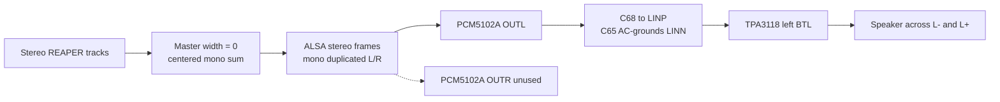

# TPA3118D2 amplifier rework and bring-up

> **STOP: DO NOT APPLY 12 V TO AN UNREWORKED SHIELD.**
>
> Do not connect speakers either. Complete both the control-net rework and the
> input-topology rework on every shield first. USB-C logic-only power is
> permitted while `+12V` is absent.

Reference state after discovery: Raspberry Pi and shield logic powered from
the Raspberry Pi USB-C connector only; external +12 V disconnected. Fail-safe
RP2350B firmware was flashed and verified in this state. It initializes `SDZ`
low and `MUTE` high, and command `0x00` also shuts the amplifier down.

## Mandatory control-net rework

The assembled PCB has three 100 kΩ resistors connected to `+12V`:

| Resistor | TPA3118 signal | RP2350B pin | Existing connection | Required connection |
| --- | --- | --- | --- | --- |
| R79 | `SDZ` | GPIO28 | 100 kΩ pull-up to +12 V | 100 kΩ pull-down to GND |
| R78 | `FAULTZ` | GPIO29 | 100 kΩ pull-up to +12 V | 100 kΩ pull-up to 3.3 V |
| R81 | `MUTE` | GPIO30 | 100 kΩ pull-up to +12 V | 100 kΩ pull-up to 3.3 V |

The TPA3118 permits its control inputs to reach PVCC, but these nets also
connect directly to RP2350B GPIOs. They must therefore stay within the RP2350B
IOVDD domain. GPIO28-30 are fail-tolerant RP2350 pads, but their absolute
maximum is 5.5 V when IOVDD is 3.3 V. A 100 kΩ series resistor limits current
but does not make 12 V valid. TPA3118 logic high requires at least 2 V, so
3.3 V is valid for all three control nets.

The revised defaults are fail-safe:

- `SDZ` low: amplifier shut down while RP2350B resets or is unprogrammed.
- `MUTE` high: amplifier muted while RP2350B resets or is unprogrammed.
- `FAULTZ` pulled up to 3.3 V: safe for the RP2350B input.

### Parts and tools

- ESD-safe fine-tip soldering iron, approximately 320-350 C, or controlled hot
  air suitable for 0402 parts.
- Flux, fine solder, tweezers, magnification, and solder wick.
- 30 AWG insulated or enamelled rework wire.
- Three 100 kΩ resistors per shield. Reuse the original 0402 resistors only if
  they can be handled reliably; otherwise use new 0402/0603 or small axial
  resistors.
- Multimeter with continuity, resistance, and DC-voltage modes.
- Kapton tape and, after electrical verification, electronics-safe adhesive to
  provide strain relief. Do not glue before testing.

### Identify the components

All three parts are on the front copper side near IC1. KiCad board coordinates
are included to remove ambiguity when comparing with the PCB editor:

| Part | Position | Orientation | Pad 1 | Pad 2 before rework |
| --- | --- | --- | --- | --- |
| R78 | X=77.0892, Y=60.8586 mm | vertical | GPIO29 / `FAULTZ` | `+12V` |
| R79 | X=78.0036, Y=60.8760 mm | vertical | GPIO28 / `SDZ` | `+12V` |
| R81 | X=82.7026, Y=59.2584 mm | horizontal | GPIO30 / `MUTE` | `+12V` |

Do not determine pad numbers by appearance alone. With every power cable
removed, continuity-test both ends of each resistor against the `+12V` input.
The end that beeps to `+12V` is pad 2 and must be isolated. Mark that end in a
board photograph before soldering.

The recommended RP2350-domain 3.3 V attachment point is **C40 pad 1**. C40 is
the 10 uF 0603 output capacitor of RP2350 LDO U3, at X=171.2, Y=58.5 mm:

- C40 pad 1: `3V3`
- C40 pad 2: GND

Confirm those nets with the meter before soldering. A Raspberry Pi header GND
pin is also a suitable, mechanically accessible GND anchor. Do not use `+12V`,
`2.8V`, `+3V3DAC`, or an amplifier output as the 3.3 V attachment point.

### Rework procedure

1. Shut down the Raspberry Pi normally.
2. Disconnect Raspberry Pi USB-C, RP2350 USB-C, bench 12 V, speakers, and all
   other cables. Remove the shield if access is restricted.
3. Verify `+12V`, `3V3`, and `+3V3` all measure below 0.1 V before soldering.
4. Photograph R78, R79, and R81. Identify each pad 2 by continuity to `+12V`.
5. Apply flux and remove R78, R79, and R81. Avoid pushing sideways while the
   solder is solid because the 0402 pads lift easily.
6. Clean the pads. Verify the three original pad-2 lands still connect to
   `+12V`, and none is bridged to pad 1.
7. Reinstall a 100 kΩ resistor from **R79 pad 1 (`SDZ`) to GND**. Leave the
   original R79 pad-2 `+12V` land empty.
8. Reinstall a 100 kΩ resistor from **R78 pad 1 (`FAULTZ`) to C40 pad 1
   (`3V3`)**. Leave the original R78 pad-2 land empty.
9. Reinstall a 100 kΩ resistor from **R81 pad 1 (`MUTE`) to C40 pad 1
   (`3V3`)**. Leave the original R81 pad-2 land empty.
10. Route wires away from IC1 output traces, inductors, and the SW node. Keep
    them flat, avoid sharp bends at pads, and temporarily secure with Kapton.
11. Inspect for solder balls, lifted pads, bridges, or exposed wire. Do not
    apply adhesive until all electrical tests pass.

An acceptable alternative is to leave each resistor attached to pad 1 and
lift only its pad-2 end, then connect that free resistor end to the destination
rail. The lifted end must have visible clearance from the old `+12V` pad and
must receive strain relief. Removing and rewiring the parts is usually easier
to inspect consistently across five boards.

## Verify before applying 12 V

### Unpowered tests

With every power source disconnected, use continuity/resistance mode:

- GPIO28/`SDZ` to GND: approximately 100 kΩ.
- GPIO29/`FAULTZ` to 3.3 V: approximately 100 kΩ.
- GPIO30/`MUTE` to 3.3 V: approximately 100 kΩ.
- GPIO28, GPIO29, and GPIO30 to `+12V`: no 100 kΩ path. A reading near 100 kΩ
  is an automatic failure and means the old connection remains.
- `3V3` to GND: no short.
- `+12V` to GND: no short.

### Logic-only powered tests

Install the shield and power the Raspberry Pi only from its USB-C connector.
Keep bench `+12V` disconnected. The fail-safe RP2350 firmware must already be
installed. Verify:

- `SDZ`: near 0 V.
- `MUTE`: near 3.3 V.
- `FAULTZ`: near 3.3 V when no fault is asserted.
- C40 pad 1: approximately 3.3 V.
- All three original pad-2 lands: 0 V because `+12V` is absent.

Send the shutdown command before continuing:

```sh
cd /home/sjc/dreammachine
python3 rp2350/pattern.py amp-shutdown
python3 rp2350/pattern.py off
```

If any measurement differs, disconnect power and repair the board. Do not
compensate for failed hardware rework in firmware.

## Staged 12 V test

Leave speakers disconnected. Set the bench supply to 12 V with a 300 mA
current limit.

1. Apply 12 V with the amplifier in shutdown. Record idle current and verify
   `SDZ` remains near 0 V.
2. Send `python3 rp2350/pattern.py amp-start-muted`. Verify `SDZ` rises to
   approximately 3.3 V, `MUTE` remains near 3.3 V, and `FAULTZ` remains high.
3. Check that neither IC1 nor the output inductors heat rapidly.
4. Measure each BTL output pair differentially. Do not reference either speaker
   terminal to ground.
5. Connect an 8 Ω dummy load rated at least 10 W to one channel before using a
   speaker.
6. Start a very low-level DAC tone, then send
   `python3 rp2350/pattern.py amp-unmute`.
7. Immediately send `python3 rp2350/pattern.py amp-mute` if current rises
   unexpectedly, `FAULTZ` goes low, or the waveform is abnormal.
8. Finish with `python3 rp2350/pattern.py amp-shutdown`.

### Low-level 8 Ω speaker alternative

If no dummy load is available, an 8 Ω speaker may be used for a tightly
limited functional check after every preceding test passes:

1. Shut down and remove all power before wiring the speaker.
2. For the left channel, connect only AUDIOOUT1 pins 1 (`OUT_L-`) and 2
   (`OUT_L+`). For the right channel, use pins 3 (`OUT_R-`) and 4 (`OUT_R+`).
3. Never connect either speaker lead to GND.
4. Restore external 12 V only, with the bench current limit at 0.5 A.
5. Stop REAPER so ALSA is free.
6. Run the guarded test at its default -50 dBFS level:

```sh
python3 rp2350/amp_speaker_test.py left
```

The script emits a 1 kHz tone for two seconds and always finishes by muting and
shutting down IC1. It refuses levels other than -50 or -40 dBFS and durations
longer than three seconds. First use -50 dBFS. Only if the sound is clean,
FAULTZ remains high, and current/temperature remain normal may the -40 dBFS
test be used:

```sh
python3 rp2350/amp_speaker_test.py left --level -40
```

Switch off 12 V immediately for clicks, harsh distortion, unexpected current,
FAULTZ low, or rapid heating. This is only a functional test, not a power test.

### Reference-unit result

Shield 1 (`sjcdm1`) passed the left-channel guarded speaker test on 2026-09-17:

- 8 Ω speaker connected only between AUDIOOUT1 pins 1 (`OUT_L-`) and 2
   (`OUT_L+`).
- Clean 1 kHz tone heard at -50 dBFS for two seconds.
- Bench current remained below 0.5 A.
- `FAULTZ` remained high.
- IC1 and the output inductors remained cool.
- Test utility completed successfully and returned IC1 to shutdown.

The right channel still requires the same guarded test on AUDIOOUT1 pins 3
(`OUT_R-`) and 4 (`OUT_R+`).

The real REAPER session was subsequently verified through the left speaker
using a temporary project copy with `MASTER_VOLUME 0.01` (approximately
-40 dB). Audio was clean and quiet, confirming the complete software-to-speaker
path. Raising volume manually caused the complete system to reboot while the
12 V bench supply was limited to 0.5 A. That limit provides only 6 W total and
is too close to the Raspberry Pi plus shield idle requirement to supply audio
transients. IC1 was shut down after reboot.

For the next controlled listening test, use a 12 V, 1.0 A current limit, keep
the temporary REAPER master at -40 dB, and do not adjust system or project
volume during playback. Increase level only in documented steps while watching
bench current and temperature.

Controlled REAPER listening results with a 12 V, 1.0 A current limit:

| Master level | Bench current | Result |
| --- | --- | --- |
| -40 dB | 0.315 A | Clean, very quiet, normal temperature |
| -30 dB | 0.318 A | Clean, quiet, normal temperature |
| -20 dB | 0.355 A | Clean, quiet, normal temperature |
| -10 dB | 0.48 A peak | Mostly clean but occasional possible distortion |

The current accepted listening ceiling is **-20 dB**. Do not use -10 dB or
higher for unattended operation until both channels are tested with a suitable
dummy load and the distortion source is measured. The original project was not
modified; all level tests used temporary hidden project copies.

## Using a 12 V, 9 A supply

The 9 A rating is the supply's maximum available current, not current that the
board will always consume. It provides useful transient headroom but does not
increase the TPA3118 output-voltage swing at a fixed 12 V. It also makes wiring
faults much more hazardous than the current-limited bench test.

- Fit a 2 A fast-acting inline fuse for initial single-channel operation.
- Use a 3 A inline fuse only after both channels pass dummy-load testing.
- Place the fuse close to the supply positive terminal.
- Use short power wiring sized for the fuse current and preserve input polarity.
- Never use an unfused 9 A feed for bring-up or exposed-board probing.
- Keep the 12 V supply common only through the intended shield power input.
- Do not connect Raspberry Pi USB-C simultaneously with shield-derived Pi power.

At 12 V into 8 Ω, one BTL channel can approach roughly 7-9 W clean output,
depending on losses and clipping margin. More supply-current capacity cannot
prevent voltage clipping. Higher supply voltage may increase power, but must
not be attempted until component ratings, cooling, both channels, and the 5 V
Pi power path are separately validated.

## Distortion measurement

Use a non-inductive 8 Ω dummy load rated at least 20 W for one channel. A 50 W
load is preferred for repeated tests. Do not use a speaker for quantitative
distortion measurements.

For a two-channel earth-referenced oscilloscope:

1. Connect both probe ground clips to board GND.
2. Connect CH1 to the channel positive output and CH2 to its negative output.
3. Use 10x probes, equal vertical scales, and DC coupling.
4. Display `CH1 - CH2` as the differential BTL waveform.
5. Never attach a probe ground clip to either speaker output.
6. Start with a 1 kHz sine at -30 dBFS and increase in 3 dB steps.
7. At each step record differential Vrms, peak shape, bench current, FAULTZ,
   and IC1/inductor temperature.
8. Stop when the sine visibly flattens, scope FFT harmonics rise sharply,
   FAULTZ falls, current becomes unstable, or heating is rapid.
9. The accepted operating ceiling is at least 3 dB below the first observed
   clipping/distortion point.

For an 8 Ω load, calculate output power from the differential RMS voltage:

$$P_{out} = \frac{V_{RMS}^{2}}{8\ \Omega}$$

Measure left and right channels separately, then both together. A 9 A supply
does not remove the need for the inline fuse or staged level increases.

## Startup behavior

REAPER opening the DAC does not itself control IC1. The RP2350B firmware always
boots with `SDZ` low and `MUTE` high, so IC1 starts shut down. The X11 autostart
wrapper performs this fail-closed sequence:

1. Assert amplifier mute and shutdown.
2. Start IC1 muted.
3. Launch REAPER with the configured project.
4. Wait until REAPER owns the HifiBerry ALSA playback device.
5. Run `reaper/force_master_mono.lua`, which sets the master pan to center and
   width to zero so all project content is included in the mono sum.
6. Send `amp-unmute`; firmware refuses to unmute if `FAULTZ` is low.
7. On REAPER exit, startup failure, session loss, SIGTERM, or script exit, mute
   and shut down IC1.

The deployed wrapper was tested on `sjcdm1`: it asserted shutdown, started IC1
muted, launched REAPER, waited for REAPER to own the HifiBerry PCM device, then
applied the mono script and unmuted. Runtime verification reported `pan=0.0`
and `width=0.0`. Terminating the wrapper closed REAPER and returned to shutdown.

Therefore a normal unattended boot starts the DAC and REAPER, then enables the
amplifier only after ALSA is ready. It does not automatically start REAPER
transport unless the project or REAPER preferences explicitly request play.

## Mono left-channel installation

This project uses one 8 Ω speaker on the left BTL channel only:

- Speaker connection: AUDIOOUT1 pin 1 (`OUT_L-`) and pin 2 (`OUT_L+`).
- AUDIOOUT1 pins 3 (`OUT_R-`) and 4 (`OUT_R+`) remain disconnected.
- REAPER master pan is centered and master width is forced to zero at startup,
   summing all left/right project content to mono.
- ALSA and PCM5102A remain physically stereo. The right DAC/amp signal may
   still carry the duplicate mono program, but the right Class-D output has no
   load and is not used.
- Never connect left and right Class-D outputs together. Never connect any
   Class-D output terminal to GND.



Do not connect an oscilloscope ground clip to a TPA3118 speaker output. Use a
differential probe, two channels with math subtraction, or measure across a
floating dummy load with appropriately isolated equipment.

### Two-channel grounded oscilloscope test

Disconnect the speaker. Attach both probe ground clips to board GND. Never
attach either ground clip to a speaker output.

- Left: CH1 tip to AUDIOOUT1 pin 2 (`OUT_L+`), CH2 tip to pin 1 (`OUT_L-`).
- Right: CH1 tip to AUDIOOUT1 pin 4 (`OUT_R+`), CH2 tip to pin 3 (`OUT_R-`).
- Use matched 10x probes, DC coupling, approximately 5 V/div and 500 us/div.
- Display the differential audio with the scope math trace `CH1 - CH2`.

Run a two-minute left-channel tone at -40 dBFS:

```sh
python3 rp2350/amp_speaker_test.py left --level -40 --duration 120 --scope
```

The script always mutes and shuts down IC1 on exit. The individual channels
may show Class-D common-mode/switching content; the math trace is the relevant
speaker voltage.

## Five-shield rework record

Do not mark a shield complete until both unpowered and logic-only voltage tests
pass. Attach close-up before/after photographs to the build record.

| Shield | R79 SDZ->GND | R78 FAULTZ->3V3 | R81 MUTE->3V3 | No path to +12V | Logic voltages | Technician/date |
| --- | --- | --- | --- | --- | --- | --- |
| 1 / sjcdm1 | pass | pass | pass | pass | pass | 2026-09-17 |
| 2 | pending | pending | pending | pending | pending |  |
| 3 | pending | pending | pending | pending | pending |  |
| 4 | pending | pending | pending | pending | pending |  |
| 5 | pending | pending | pending | pending | pending |  |

## Mandatory single-ended input rework

The PCM5102A has single-ended `OUTL` and `OUTR` outputs. The assembled PCB
connects each output through two equal capacitors to both the positive and
negative TPA3118 inputs:

- `OUTL` feeds `LINP` through C68 and also feeds `LINN` through C65.
- `OUTR` feeds `RINP` through C66 and also feeds `RINN` through C67.

That produces nearly identical signals on each differential pair, so the
TPA3118 cancels them: `Vdiff = Vpositive - Vnegative` is approximately zero.
This was confirmed on shield 1 by two silent speaker tests with correct SDZ,
MUTE, FAULTZ, current, and temperature.

After the C65/C67 rework, the left speaker remained silent at -50 and -40 dBFS
because PCM5102A `XSMT` was floating. After XSMT was tied to `+3.3VDAC`, clean
alternating 1 kHz waveforms were verified at `OUTL` and `OUTR`. The DAC path is
now accepted and guarded amplifier testing may resume.

Texas Instruments specifies that, for a single-ended source, the audio signal
goes to one input and the other input is AC-grounded through an equal-value
capacitor. Keep C68 and C66 connected to the PCM5102 outputs. Change only the
source side of C65 and C67 to GND:

| Part | Position | Existing pad 1 | Pad 2 | Required pad 1 |
| --- | --- | --- | --- | --- |
| C65 | X=60.6173, Y=55.3341 mm | `OUTL` | `LINN` | GND |
| C67 | X=66.9800, Y=58.0900 mm | `OUTR` | `RINN` | GND |

### Input rework procedure

1. Mute and shut down the amplifier, shut down the Pi, then disconnect every
   power source and the speaker.
2. Verify all rails are below 0.1 V.
3. Identify C65 and C67. Both are 1 uF 1206 capacitors.
4. Continuity-test each end before soldering:
   - C65 pad 1 currently beeps to PCM5102 `OUTL`.
   - C67 pad 1 currently beeps to PCM5102 `OUTR`.
   - Pad 2 must remain connected to the corresponding TPA3118 negative input.
5. Isolate C65 pad 1 from `OUTL`. Either lift only the capacitor's pad-1 end or
   remove C65 and reinstall it with pad 1 lifted. Do not remove the PCB pad.
6. Connect the lifted/free C65 pad-1 terminal to GND with a short insulated
   wire. Leave C65 pad 2 on its original `LINN` PCB pad.
7. Repeat for C67: isolate pad 1 from `OUTR`, connect that capacitor terminal
   to GND, and leave pad 2 connected to `RINN`.
8. Keep C68 (`OUTL` to `LINP`) and C66 (`OUTR` to `RINP`) unchanged.
9. Inspect and provide strain relief only after electrical tests pass.

### Input rework verification

With all power disconnected:

- C65 pad 1 to GND: continuity.
- C67 pad 1 to GND: continuity.
- C65 pad 1 to `OUTL`: no continuity.
- C67 pad 1 to `OUTR`: no continuity.
- C65 pad 2 to GND: not a direct short; it reaches `LINN` through the original
  trace and remains separated by C65.
- C67 pad 2 to GND: not a direct short; it reaches `RINN` through the original
  trace and remains separated by C67.
- C68 and C66 remain connected to `OUTL` and `OUTR`, respectively.

Repeat the logic-only and enabled-muted checks before reconnecting a speaker.

Reference input result (`sjcdm1`, 2026-09-17): with IC1 enabled and muted,
C68 pad 2 (`LINP`) showed the clean 1 kHz left-channel waveform and C65 pad 2
(`LINN`) was AC-flat. The corrected left differential input path passes.

### Five-shield input rework record

| Shield | C65 source->GND | C67 source->GND | C68 unchanged | C66 unchanged | Continuity pass | Technician/date |
| --- | --- | --- | --- | --- | --- | --- |
| 1 / sjcdm1 | pass | pass | pass | pass | pass | 2026-09-17 |
| 2 | pending | pending | pending | pending | pending |  |
| 3 | pending | pending | pending | pending | pending |  |
| 4 | pending | pending | pending | pending | pending |  |
| 5 | pending | pending | pending | pending | pending |  |