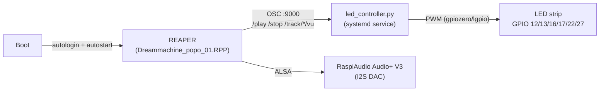

# Dreammachine_Rpi_popo

Raspberry Pi control system for **DREAMMACHINE**, for an art installation. Each Pi runs a REAPER session through a RaspiAudio Audio+ V3
sound shield, while a Python service drives a synchronized LED strip, reacting
live to REAPER's transport/playback state over OSC (ReaOSC). The whole thing
boots unattended, kiosk-style — no keyboard, mouse, or monitor required on site.

Reference build: **sjcdm1** (unit 1). Once verified end-to-end, the exact same
setup is cloned to 4 more identical Pis — see [MIGRATION.md](MIGRATION.md).



## Status

| Unit | Hostname | Audio | REAPER + OSC | LED service | Autoboot |
|---|---|---|---|---|---|
| 1 (reference) | sjcdm1 | ✅ | 🔄 in progress | ✅ | ✅ |
| 2-5 | TBD | ⬜ | ⬜ | ⬜ | ⬜ |

See [MIGRATION.md](MIGRATION.md) for the full fleet tracking table.

## Hardware / OS

| Item | Value |
|---|---|
| Board | Raspberry Pi 4 Model B Rev 1.5 |
| OS | Raspberry Pi OS (Debian 13 "trixie"), 64-bit, desktop (X11/Openbox — see Troubleshooting) |
| Sound shield | RaspiAudio Audio+ V3 (`snd_rpi_hifiberry_dac`, auto-detected via EEPROM, **no config.txt edit needed**) |
| LED strip | PWM MOSFET strip via `gpiozero`/`lgpio`, GPIO 12,13,16,17,22,27 (configurable) |

⚠️ **GPIO 18, 19, 20, 21 are reserved by the Audio+ shield's I2S bus** — never reuse
them for the LED strip or anything else. GPIO 0/1 are used by the shield's ID
EEPROM. Confirmed free/default LED pins: **12, 13, 16, 17, 22, 27**.

## Network

| Pi | Hostname | User | IP | SSH key |
|---|---|---|---|---|
| Unit 1 (reference) | sjcdm1 | sjc | 192.168.88.104 | `~/.ssh/id_ed25519_dreammachine` |
| Unit 2-5 | TBD | sjc | TBD | same key, once installed |

Password for `sjc` user: `sjcsjc` (only needed until the SSH key is installed).

SSH pattern (Windows PowerShell):
```powershell
$env:PATH += ";C:\Windows\System32\OpenSSH"
ssh -i "$env:USERPROFILE\.ssh\id_ed25519_dreammachine" -o IdentitiesOnly=yes -o StrictHostKeyChecking=no sjc@192.168.88.104
```

## Repo layout

```
setup/            install scripts, run once per Pi (idempotent)
config/           dreammachine.env — single source of config (pins, ports, paths)
led/              led_controller.py — OSC-driven LED controller (systemd service)
reaper/           placeholder project + OSC setup instructions
systemd/          unit files installed on the Pi
MIGRATION.md      steps to clone the working setup to Pi 2-5
```

## Setup order (on a fresh Pi)

```bash
bash setup/01_system_base.sh      # apt update/upgrade, gpiozero/lgpio, python venv, alsa
bash setup/02_install_reaper.sh   # download + install REAPER (aarch64 eval)
bash setup/03_led_service.sh      # venv + python-osc + systemd LED service
bash setup/04_vnc_and_autostart.sh  # enable VNC, kiosk autologin, REAPER autostart
bash setup/05_install_reaper_extensions.sh  # SWS/S&M + ReaPack (restart REAPER after)
```
Or run all at once: `bash setup/run_all.sh`

After `02_install_reaper.sh`, REAPER must be **launched once via VNC/HDMI** to
create `reaper.ini`, then the audio device and OSC control surface are
configured manually (see [reaper/OSC_SETUP.md](reaper/OSC_SETUP.md)) — this
only needs doing once, then `reaper.ini` is copied verbatim to the other Pis.

## REAPER extensions (SWS/S&M + ReaPack)

`setup/05_install_reaper_extensions.sh` installs two community-standard REAPER
extensions straight into `~/.config/REAPER/UserPlugins/`:

- **[SWS/S&M](https://www.sws-extension.org/)** (`reaper_sws-aarch64.so`) — a large
  bundle of extra actions, tools and utilities (batch processing, extra track/item
  management, grooves, notes, etc.) that most non-trivial REAPER setups rely on.
- **[ReaPack](https://reapack.com/)** (`reaper_reapack-aarch64.so`) — REAPER's
  package manager. It lets REAPER pull in and auto-update community scripts,
  JSFX effects, and themes from public repositories, instead of copying files by
  hand.

Both are official aarch64 Linux builds (SWS's bleeding-edge build page publishes
the only aarch64 binary available; ReaPack's GitHub release provides one
directly). ⚠️ The ReaPack `.so` **must** keep its `-aarch64` filename suffix —
renaming it triggers a "not loaded from the standard extension path" warning,
since ReaPack uses that suffix to find the right asset for its own self-updates.

Once installed (REAPER needs a restart to load new extensions), use
**Extensions > ReaPack > Synchronize packages** to pull in the package
index, then **Extensions > ReaPack > Browse packages** to search and install
any additional scripts/JSFX from the community repositories — this is how
REAPER's functionality gets extended going forward without editing this repo.

## Tremor sound source (real seismic sonification)

`reaper/tremor_samples/` contains real ground-motion audio generated with
[DZA01](https://github.com/RVX/DZA_Borehole_Sonification), a GPL-3.0 sonification
toolkit that pulls live seismic data from the DZA borehole network (KIT/GPI,
Germany) and speeds it up into the audible range (a straight frequency shift,
no synthesis). One clip per site/depth combination, 3 minutes each, 0.5–10 Hz
bandpass, 100x speed-up, vertical channel:

| File | Site | Sensor |
|---|---|---|
| `tremor_DZA11_surface_vertical.wav` | Site 1 | surface (Trillium Compact 20s) |
| `tremor_DZA13_borehole_vertical.wav` | Site 1 | borehole, ~240 m depth |
| `tremor_DZA31_surface_vertical.wav` | Site 3 | surface (Trillium Horizon 120s) |
| `tremor_DZA33_borehole_vertical.wav` | Site 3 | borehole, ~240 m depth |

Import these into the REAPER project as audio items to use as ambient/tremor
material (the borehole clips are quieter/deeper-feeling; the surface clips
carry more transient detail). Regenerate or fetch a fresh/longer window any
time with the toolkit itself, e.g.:
```bash
python DZA01.py --sites 1,3 --listen-minutes 3 --channel all fetch plot sonify
```

## Troubleshooting

**"Error opening devices... JACK error creating client"** on first boot: REAPER
auto-picks JACK as its audio system because `libjack-jackd2-0` is present
(pulled in as a dependency), even though no JACK server runs on the Pi. Fix
once via Preferences > Audio > Device > Audio System: `ALSA`, Device:
`hw:3,0` (see [reaper/OSC_SETUP.md](reaper/OSC_SETUP.md)).

**"There was an error opening the project: Dreammachine_popo_01.RPP"** on
first boot: expected until the project is saved for the first time via
**File > Save As** (see [reaper/OSC_SETUP.md](reaper/OSC_SETUP.md)) — the
autostart script always points at this path.

**Drag-and-drop into REAPER doesn't work (Insert > Media File does)**: the
default Raspberry Pi OS desktop session is `labwc` (Wayland); REAPER is an
X11-only app and runs under it via XWayland. Drag-and-drop across the
XWayland↔native-Wayland boundary (e.g. from the file manager) is unreliable on
wlroots-based compositors like labwc — this happens with a directly-connected
mouse/keyboard too, it isn't VNC-specific. `setup/04_vnc_and_autostart.sh`
switches the session to plain X11 (`raspi-config nonint do_wayland W1`,
Openbox) instead, which avoids the problem entirely; REAPER's autostart is
then configured via `~/.config/lxsession/rpd-x/autostart` +
`systemd/start_reaper.sh` rather than a labwc autostart file.

## Robustness measures

- `dreammachine-led.service` runs as a systemd service with `Restart=always`.
- LED script installs a `SIGTERM` handler so `systemctl stop` / reboot always
  turns the strip off cleanly instead of leaving the last PWM duty cycle
  latched on the MOSFETs.
- Pi boots straight to desktop (autologin, kiosk), REAPER autostarts and loads
  the project automatically — no keyboard/monitor needed on site.
- Hardware watchdog enabled (see `setup/04_vnc_and_autostart.sh`).

## License

Internal production tooling for the DREAMMACHINE installation. No license
granted for reuse outside the project unless stated otherwise by the author.

## Credits

Built for **DREAMMACHINE** by Víctor Mazón Gardoqui. 2026.
