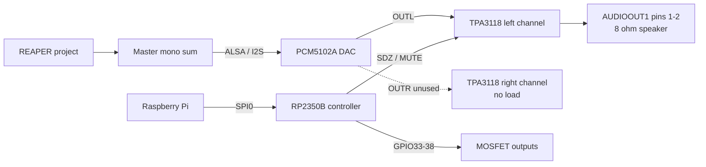
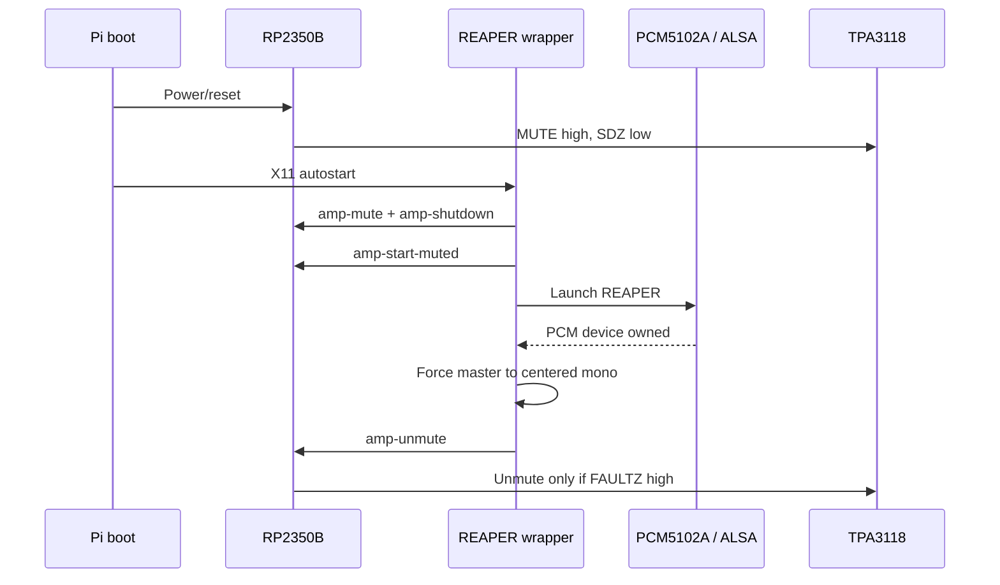
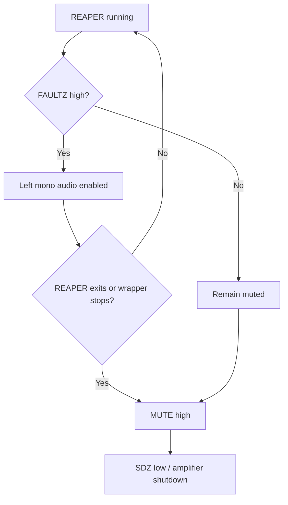

# Dreammachine_Rpi_popo

> **HARDWARE HOLD:** Do not apply external 12 V to any custom shield until
> R78/R79/R81 control nets and C65/C67 single-ended inputs have been reworked
> and signed off using [AMP_TEST.md](AMP_TEST.md). PCM5102A pin 17 `XSMT` must
> also be tied to `+3.3VDAC` per [DAC_TEST.md](DAC_TEST.md). USB-C logic-only
> operation is allowed.

Raspberry Pi control system for **DREAMMACHINE**, for an art installation. Each Pi runs a REAPER session through the custom PCM5102A
sound shield, while a separate Python service drives an LED strip running a
permanent 60-minute FLS stroboscopic protocol, independent of REAPER and with
no OSC/network/Telegram override (as of 2026-09-30). The whole thing
boots unattended, kiosk-style — no keyboard, mouse, or monitor required on site.

Reference build: **sjcdm1** (unit 1). Once verified end-to-end, the exact same
setup is cloned to 4 more identical Pis — see [MIGRATION.md](MIGRATION.md).


```mermaid
flowchart LR
  A["REAPER project"] --> B["Master mono sum"]
  B -->|"ALSA / I2S"| C["PCM5102A DAC"]
  C -->|"OUTL"| D["TPA3118 left channel"]
  D --> E["AUDIOOUT1 pins 1-2\n8 ohm speaker"]
  C -.->|"OUTR unused"| F["TPA3118 right channel\nno load"]
  G["Raspberry Pi"] -->|"SPI0"| H["RP2350B controller"]
  H -->|"SDZ / MUTE"| D
  H -->|"GPIO33-38"| I["MOSFET outputs"]
```

The installation is **mono, left output only**. REAPER sums its master to
centered mono at runtime. Never parallel or bridge the TPA3118 left and right
outputs; leave AUDIOOUT1 pins 3-4 disconnected.


```mermaid
sequenceDiagram
  participant Boot as Pi boot
  participant RP as RP2350B
  participant R as REAPER wrapper
  participant DAC as PCM5102A / ALSA
  participant AMP as TPA3118

  Boot->>RP: Power/reset
  RP->>AMP: MUTE high, SDZ low
  Boot->>R: X11 autostart
  R->>RP: amp-mute + amp-shutdown
  R->>RP: amp-start-muted
  R->>DAC: Launch REAPER
  DAC-->>R: PCM device owned
  R->>R: Force master to centered mono
  R->>RP: amp-unmute
  RP->>AMP: Unmute only if FAULTZ high
```


```mermaid
flowchart TD
  A["REAPER running"] --> B{"FAULTZ high?"}
  B -->|"Yes"| C["Left mono audio enabled"]
  B -->|"No"| D["Remain muted"]
  C --> E{"REAPER exits or wrapper stops?"}
  E -->|"No"| A
  E -->|"Yes"| F["MUTE high"]
  D --> F
  F --> G["SDZ low / amplifier shutdown"]
```

## Status

| Unit | Hostname | Tailscale | RustDesk ID | Audio | REAPER + OSC | LED service | FLS protocol | Autoboot |
|---|---|---|---|---|---|---|---|---|
| 1 | sjcdm1 | 100.64.131.41 | 336347711 | ✅ | ✅ | ✅ | ✅ | ✅ |
| 2 | sjcdm2 | 100.114.177.74 | 336348152 | ✅ | ✅ | ✅ | ✅ | ✅ |
| 3 | sjcdm3 | 100.85.254.127 | 336348338 | ✅ | ✅ | ✅ | ✅ | ✅ |
| 4 (reference) | sjcdm4 | 100.103.58.47 | 336348023 | ✅ | ✅ | ✅ | ✅ | ✅ |
| 5 | sjcdm5 | 100.93.96.91 | 336347026 | ✅ | ✅ | ✅ | ✅ | ✅ |

All units provisioned with `provisioning/provision_unit.sh` v2. See [MIGRATION.md](MIGRATION.md) for cloning details.

## Hardware / OS

| Item | Value |
|---|---|
| Board | Raspberry Pi 4 Model B Rev 1.5 |
| OS | Raspberry Pi OS (Debian 13 "trixie"), 64-bit, desktop (X11/Openbox — see Troubleshooting) |
| Sound shield | Custom PCM5102A (`hifiberry-dac` overlay, ALSA `snd_rpi_hifiberry_dac`) |
| LED control | RP2350B GPIO33-38; SPI-driven from Pi |
| Remote access | Tailscale (mesh VPN) + RustDesk (headless-capable) |
| Notifications | Telegram bot + email on boot/join |
| Remote commands | `/status` `/update` `/flash` via Telegram (FLS runs permanently, no start/stop command) |

**GPIO 18, 19, and 21 are reserved for PCM5102A I2S. GPIO16-20 are reserved
for RP2350B SPI/IRQ, GPIO23/24 for SWD debug, and GPIO0/1 for serial.** The
`dreammachine-led.service` runs `led/led_controller_spi.py` (permanent FLS
protocol, SPI-based, no OSC) — the legacy direct-GPIO `led_controller.py` is
deprecated.

## Network

| Pi | Hostname | User | WiFi SSID (pinned) | Local IP | Tailscale IP | RustDesk ID | RustDesk PW |
|---|---|---|---|---|---|---|---|
| 1 | sjcdm1 | sjc | OMR-Equipo | ? (not yet checked) | 100.64.131.41 | 336347711 | OMRdream1 |
| 2 | sjcdm2 | sjc | OMR-Equipo | 192.168.1.198 | 100.114.177.74 | 336348152 | OMRdream2 |
| 3 | sjcdm3 | sjc | OMR-Equipo | ? (not yet checked) | 100.85.254.127 | 336348338 | OMRdream3 |
| 4 | sjcdm4 | sjc | OMR-Equipo | 192.168.1.77 | 100.103.58.47 | 336348023 | OMRdream4 |
| 5 | sjcdm5 | sjc | OMR-Equipo | 192.168.1.203 | 100.93.96.91 | 336347026 | OMRdream5 |

Password for `sjc` user: `sjcsjc` (only needed until the SSH key is installed).
WiFi: **OMR-Equipo only** (equipment network — OMR-VISITAS has AP isolation).
The venue also broadcasts `OMR-WIFI-5G` on the same 192.168.1.0/24 subnet —
**do not let units auto-connect to it**: found on 2026-09-30 that dm2 had a
stray `OMR-WIFI-5G` NetworkManager profile with a *higher* autoconnect
priority than `OMR-Equipo`, which could silently roam the Pi onto a different
DHCP lease/IP and break RustDesk's cached direct-connect address. Every unit
should have only `OMR-Equipo` set to autoconnect (`provisioning/field_fix.sh`
enforces this — see "Field fix" below). On-site, if a RustDesk ID connection
fails, connect by the unit's **Local IP** above instead — direct-IP bypasses
the relay entirely and was confirmed reliable when the ID/relay path was not.

SSH pattern (Windows PowerShell):
```powershell
$env:PATH += ";C:\Windows\System32\OpenSSH"
ssh -i "$env:USERPROFILE\.ssh\id_ed25519_dreammachine" -o IdentitiesOnly=yes -o StrictHostKeyChecking=no sjc@<TAILSCALE_IP>
```

### Field fix (run once per unit when on-site)

Applies everything found/fixed during the 2026-09-30 reliability pass:
timezone, WiFi pinning, watchdogs, show-hours gating, monitoring. Idempotent,
safe to re-run.
```bash
ssh sjc@<unit local IP or hostname.local> 'cd /home/sjc/dreammachine && git pull && bash provisioning/field_fix.sh'
```

**Headless RustDesk fix:** all units have `video=HDMI-A-1:1920x1080@60e` in
`/boot/firmware/cmdline.txt` and `/etc/xdg/autostart/set-display-resolution.desktop`
to force 1080p output even with no monitor attached. Without this, RustDesk shows
"No Displays".

## Repo layout

```
setup/            install scripts, run once per Pi (idempotent)
config/           dreammachine.env — single source of config (pins, ports, paths)
led/              led_controller_spi.py — permanent FLS LED controller (SPI to RP2350, no OSC)
reaper/           Lua autoloop scripts, startup, force_master_mono, ensure_reaper_audio
systemd/          unit files installed on the Pi (start_reaper.sh with amp watchdog)
tools/            utilities (speaker_test: speaker comparison/calibration signals)
provisioning/     cloud-init, provision_unit.sh v2, notify.py, telegram_bot.py,
                  dm_update.sh, spi_test.py, amp_test.py
rp2350/           RP2350B firmware (main.c, CMakeLists, pattern.py test scripts)
Dreammachine_LIGHTCODE/  FLS research protocol reference (fls_60min_rp2350b.ino)
golden-master/    sjcdm4 state snapshot (reaper.ini, RPP, scripts, services)
MIGRATION.md      steps to clone the working setup to Pi 2-5
```

## Setup order (on a fresh Pi)

```bash
bash setup/01_system_base.sh      # apt update/upgrade, gpiozero/lgpio, python venv, alsa
bash setup/01_audio_dac.sh        # enable PCM5102A overlay; reboot and run again to test
bash setup/02_install_reaper.sh   # download + install REAPER (aarch64 eval)
bash setup/04_vnc_and_autostart.sh  # enable VNC, kiosk autologin, REAPER autostart
bash setup/05_install_reaper_extensions.sh  # SWS/S&M + ReaPack (restart REAPER after)
```
Or run all at once: `bash setup/run_all.sh`

Do not run `setup/03_led_service.sh` on the custom shield. It belongs to the
older direct-GPIO design and will be replaced by the RP2350B SPI service.

**One-shot provisioning** (recommended): use `provisioning/provision_unit.sh v2`
on a fresh Pi. Requires /tmp assets: reaper.tar.xz, reaper_sws-aarch64.so,
reaper_reapack-aarch64.so, rustdesk-aarch64.deb, dreammachine_rp2350.elf.
Handles: packagekitd kill, REAPER nested path detection, rpd-x session force,
RustDesk per-unit password, RPP reference fix, all autostart files.

After `02_install_reaper.sh`, REAPER must be **launched once via VNC/HDMI** to
create `reaper.ini`, then the audio device and OSC control surface are
configured manually (see [reaper/OSC_SETUP.md](reaper/OSC_SETUP.md)) — this
only needs doing once, then `reaper.ini` is copied verbatim to the other Pis.

Before connecting speakers or enabling the amplifier, complete the repeatable
[PCM5102A DAC acceptance test](DAC_TEST.md) on each unit.

Before applying 12 V, complete the mandatory control-net rework and staged
[TPA3118D2 amplifier test](AMP_TEST.md).

RP2350B firmware flashing, the SPI pin map, command protocol, and pattern test
are documented in [RP2350.md](RP2350.md).

### RP2350 command set (single-byte SPI)

| Byte | Action |
| ---: | --- |
| `0x00` | All MOSFETs off + amp shutdown + stop fades |
| `0x01`-`0x06` | Pulse channel 1-6 for 500 ms (blocking) |
| `0x07` | Dual pulse AMOS1+2, 100 ms (kick-sync, blocking) |
| `0x08` | **AMOS1+2 held ON** (non-blocking, until 0x09/0x00) — FLS strobe |
| `0x09` | **AMOS1+2 OFF** (non-blocking) — FLS strobe |
| `0x10` | Chase pattern |
| `0x11` | Bounce pattern |
| `0x12` | Flash all 5x |
| `0x20`-`0x23` | Amp control (shutdown / start-muted / unmute / mute) |
| `0x51`-`0x56` | Fade IN channel 1-6 (0→100% over ~1 s, non-blocking) |
| `0x61`-`0x66` | Fade OUT channel 1-6 (100→0% over ~1 s, non-blocking) |
| `0x71`-`0x76` | Stop fade on channel 1-6 and turn off |

**FLS protocol note:** `0x08`/`0x09` were added because `0x07` blocks the RP2350
main loop for 100 ms, making Pi-side variable duty-cycle strobing impossible.
The Pi now sends `0x08` (ON) + `0x09` (OFF) with microsecond-precision sleeps
for the full 16-phase, 60-minute research protocol (0.2-18 Hz, 0-50% duty).

## REAPER extensions (SWS/S&M + ReaPack)

`setup/05_install_reaper_extensions.sh` installs two community-standard REAPER
extensions straight into `~/.config/REAPER/UserPlugins/`:

- **[SWS/S&M](https://www.sws-extension.org/)** (`reaper_sws-aarch64.so`) — a large
  bundle of extra actions, tools and utilities (batch processing, extra track/item
  management, grooves, notes, etc.) that most non-trivial REAPER setups rely on.
- **[ReaPack](https://reapack.com/)** (`reaper_reapack-aarch64.so`) — REAPER's
  package manager. It lets REAPER pull in and auto-update community scripts,
  JSFX effects, and themes from public repositories, instead of copying files by
  hand.

Both are official aarch64 Linux builds (SWS's bleeding-edge build page publishes
the only aarch64 binary available; ReaPack's GitHub release provides one
directly). ⚠️ The ReaPack `.so` **must** keep its `-aarch64` filename suffix —
renaming it triggers a "not loaded from the standard extension path" warning,
since ReaPack uses that suffix to find the right asset for its own self-updates.

Once installed (REAPER needs a restart to load new extensions), use
**Extensions > ReaPack > Synchronize packages** to pull in the package
index, then **Extensions > ReaPack > Browse packages** to search and install
any additional scripts/JSFX from the community repositories — this is how
REAPER's functionality gets extended going forward without editing this repo.

## Tremor sound source (real seismic sonification)

`reaper/tremor_samples/` contains real ground-motion audio generated with
[DZA01](https://github.com/RVX/DZA_Borehole_Sonification), a GPL-3.0 sonification
toolkit that pulls live seismic data from the DZA borehole network (KIT/GPI,
Germany) and speeds it up into the audible range (a straight frequency shift,
no synthesis). One clip per site/depth combination, 3 minutes each, 0.5–10 Hz
bandpass, 100x speed-up, vertical channel:

| File | Site | Sensor |
|---|---|---|
| `tremor_DZA11_surface_vertical.wav` | Site 1 | surface (Trillium Compact 20s) |
| `tremor_DZA13_borehole_vertical.wav` | Site 1 | borehole, ~240 m depth |
| `tremor_DZA31_surface_vertical.wav` | Site 3 | surface (Trillium Horizon 120s) |
| `tremor_DZA33_borehole_vertical.wav` | Site 3 | borehole, ~240 m depth |

Import these into the REAPER project as audio items to use as ambient/tremor
material (the borehole clips are quieter/deeper-feeling; the surface clips
carry more transient detail). Regenerate or fetch a fresh/longer window any
time with the toolkit itself, e.g.:
```bash
python DZA01.py --sites 1,3 --listen-minutes 3 --channel all fetch plot sonify
```

## Speaker test/calibration signals

`tools/speaker_test/generate_speaker_test_signals.py` synthesizes a full set
of 24-bit/48kHz WAV test signals (reference tone, pink/white noise, log
sweeps, ISO 1/3-octave band scan, impulse/square wave, polarity pulse, stereo
L/R identification, a synthesized kick transient, and multi-level THD probe
tones) for comparing candidate speakers and picking one for the installation.
See [tools/speaker_test/README.md](tools/speaker_test/README.md) for the full
test protocol and `tools/speaker_test/scorecard_template.csv` to log results.
Generate with:
```bash
cd tools/speaker_test
python -m venv venv && venv/Scripts/activate  # or source venv/bin/activate
pip install -r requirements.txt
python generate_speaker_test_signals.py
```

## Sound shield HAT ID EEPROM

The RaspiAudio Audio+ V3 shield carries a small I2C ID EEPROM (address `0x50`)
that tells the Pi which device-tree overlay to load — this is what lets the
board auto-detect as `snd_rpi_hifiberry_dac` with no `config.txt` edits.
Decoded contents (read on sjcdm1, `raspi-utils-eeprom` package):

```
# Start of atom #0 of type 0x0001 and length 49
# Vendor info
product_uuid 23d8a259-e02b-40b6-97d1-052bd892f32f
product_id 0x2424
product_ver 0x0001
vendor "Raspiaudio.com"   # length=14
product "Pi Audio V3"   # length=11
# End of atom. CRC16=0xc525

# Start of atom #1 of type 0x0002 and length 32
# GPIO map info
gpio_drive 0
gpio_slew 0
gpio_hysteresis 0
back_power 0
#        GPIO  FUNCTION  PULL
#        ----  --------  ----
setgpio  2      ALT0     DEFAULT
setgpio  3      ALT0     DEFAULT
setgpio  18      ALT0     DEFAULT
setgpio  19      ALT0     DEFAULT
setgpio  20      ALT0     DEFAULT
setgpio  21      ALT0     DEFAULT
# End of atom. CRC16=0x4280

# Start of atom #2 of type 0x0003 and length 16
dt_blob "
hifiberry-dac
\"
# End of atom. CRC16=0x8c03
```

Confirms the shield is a RaspiAudio "Pi Audio V3" board identifying itself via
the `hifiberry-dac` overlay.

**How this was produced** (note: `rpi-eeprom-config`/`rpi-eeprom-update` are a
different tool for the Pi's own bootloader SPI EEPROM — not this):

1. The dedicated ID EEPROM I2C bus is off by default; enable it with
   `dtparam=i2c_vc=on` appended to `/boot/firmware/config.txt`, then reboot.
   A new bus appears (`i2c-0` here); confirm the EEPROM address with
   `sudo i2cdetect -y 0` (`0x50` = standard HAT/HAT+).
2. Dump the raw binary with `eepflash.sh` (from `raspi-utils-eeprom`):
   ```bash
   sudo eepflash.sh -r -y -f=hifiberry_eeprom_dump.eep -t=24c32 -d=0 -a=50
   ```
3. Decode the binary into the human-readable atoms shown above:
   ```bash
   eepdump hifiberry_eeprom_dump.eep hifiberry_eeprom_dump.txt
   ```

## Golden-Master Parity Checklist

**Run this on every unit whenever it's touched — new provisioning, a git
pull/deploy, or just "bringing it up to date" — not just on units that seem
to have a problem.** dm2 and dm3 each independently lost hours this way:
older units silently missed fixes/services that got added to
`provision_unit.sh` *after* they were first imaged, and nothing ever flagged
the gap because each fix only shows symptoms once someone happens to hit
that specific scenario (a reboot with no monitor, a dongle pulled out, etc).
`git log`/`git pull` succeeding is **not** evidence a unit is caught up —
several of these are config/state changes that live outside git (kernel
cmdline, systemd enablement, physically-flashed firmware) or file
permissions that git can silently fail to restore (see exec-bit note below).

Copy this list per-unit and check every line — don't assume "it's probably
fine" for anything not visibly broken:

1. **Desktop session is X11, not Wayland/labwc.**
   `ps aux | grep -E 'Xorg|labwc'` — must show `Xorg`/`Openbox`, not
   `labwc`. If `labwc` is running, `sudo raspi-config nonint do_wayland W1`
   and reboot (a live session won't switch without one, even if
   `/etc/lightdm/lightdm.conf` already says `user-session=rpd-x`). Symptom
   if missed: RustDesk prompts "Please select the screen to be shared" and
   drag-and-drop into REAPER is unreliable.
2. **Headless RustDesk resolution fix is present.**
   `ls /etc/xdg/autostart/set-display-resolution.desktop` and
   `grep video=HDMI /boot/firmware/cmdline.txt` — both must exist. If
   either is missing: `sudo cp provisioning/set-display-resolution.desktop
   /etc/xdg/autostart/` and `sudo sed -i 's/ quiet splash/ quiet splash
   video=HDMI-A-1:1920x1080@60e/' /boot/firmware/cmdline.txt` (guard with
   `grep -q video=HDMI ... || sed ...` to avoid double-patching). Symptom if
   missed: RustDesk shows "No Displays" or a black screen with no monitor
   attached.
3. **`start_reaper.sh` (and any other directly-`@exec`'d autostart script)
   still has its executable bit**, and REAPER is actually running — not
   just "the bit looks fine".
   `ls -la systemd/start_reaper.sh` (must show `x`), then `pgrep -af
   '/usr/local/bin/reaper'` and `sudo fuser -v /dev/snd/pcmC<N>D0p` (get
   `<N>` from `aplay -l | grep -A1 sndrpihifiberry` — **the DAC card number
   is not the same on every unit**, don't assume `C2D0p`). A missing +x bit
   fails **completely silently** — no error anywhere, sibling autostart
   entries still launch fine — because `core.fileMode false` (set
   fleet-wide) stops git from ever re-applying a lost +x bit on a pull that
   doesn't change that file's content.
4. **RP2350 firmware on the physical chip matches the current
   `rp2350/main.c` source**, not just "the source got pulled".
   `md5sum rp2350/main.c` and compare against a known-good unit (or
   `grep -n '0x08\|0x09' rp2350/main.c` to confirm the FLS command handlers
   exist in source at all). If the source is current but the running
   behavior is stale, the compiled `.elf` needs rebuilding+reflashing — if
   this unit lacks the Pico SDK toolchain (`ls ~/pico-sdk`, `which cmake
   arm-none-eabi-gcc`), it's safe to scp a `.elf` from another unit whose
   `main.c` md5sum matches exactly, then flash locally with `sudo openocd
   -f rp2350/rpi4-rp2350-swd.cfg -f target/rp2350.cfg -c "program
   rp2350/build/dreammachine_rp2350.elf verify reset exit"` — openocd must
   run on the target unit itself (talks to the chip over local SWD wiring)
   but the elf itself is fully portable given identical source. After
   flashing, restart whatever talks to the RP2350 over SPI (`sudo
   systemctl restart dreammachine-led.service`) and check its log for the
   expected startup line.
5. **Network hardening services are active.**
   `systemctl is-active wifi-portal usb-wifi-config network-watchdog` — all
   three must say `active`. If not deployed yet, see the "Network
   resilience hardening" changelog entry below for the full service list.
6. **Only sjcdm4 runs a Telegram poller.**
   `systemctl is-active telegram-bot.service` must be `inactive`/disabled
   on every unit except dm4 (which runs
   `telegram-bot-master.service` instead). Two active pollers on the same
   bot token silently drop random commands (see Telegram 409 changelog
   entry).
7. **Git is actually caught up, not just "pulled without error".**
   `git log -1 --oneline` compared against the reference unit — a clean
   fast-forward pull can still leave a unit behind if it was stashed
   instead of merged, or if the reference unit itself got a later commit
   after this unit's last pull.
8. **No conflicting VNC server is listening on :5900.**
   `systemctl is-active wayvnc.service wayvnc-control.service
   vncserver-x11-serviced.service` — all three must say `inactive`/`failed`
   (masked), and `sudo ss -tlnp | grep 5900` must show nothing listening.
   Raspberry Pi OS ships both RealVNC (`vncserver-x11-serviced.service`) and
   Wayland VNC (`wayvnc.service`+`wayvnc-control.service`) fighting over the
   same port; wayvnc loses the bind and restart-loops forever, which wedges
   `multi-user.target`/`graphical.target` on boot (found on dm3, confirmed
   present on dm1 too — check every unit, don't assume only one was ever
   affected). RustDesk is the only remote-access tool this project uses.
   `provision_unit.sh`/`field_fix.sh` both mask all four VNC-related units
   now; re-run `field_fix.sh` on any unit still showing active.

## Troubleshooting

**"Error opening devices... JACK error creating client"** on first boot: REAPER
auto-picks JACK as its audio system because `libjack-jackd2-0` is present
(pulled in as a dependency), even though no JACK server runs on the Pi. Fix
once via Preferences > Audio > Device > Audio System: `ALSA`, Device:
`hw:3,0` (see [reaper/OSC_SETUP.md](reaper/OSC_SETUP.md)).

**"There was an error opening the project: Dreammachine_popo_01.RPP"** on
first boot: expected until the project is saved for the first time via
**File > Save As** (see [reaper/OSC_SETUP.md](reaper/OSC_SETUP.md)) — the
autostart script always points at this path.

**Drag-and-drop into REAPER doesn't work (Insert > Media File does)**: the
default Raspberry Pi OS desktop session is `labwc` (Wayland); REAPER is an
X11-only app and runs under it via XWayland. Drag-and-drop across the
XWayland↔native-Wayland boundary (e.g. from the file manager) is unreliable on
wlroots-based compositors like labwc — this happens with a directly-connected
mouse/keyboard too, it isn't VNC-specific. `setup/04_vnc_and_autostart.sh`
switches the session to plain X11 (`raspi-config nonint do_wayland W1`,
Openbox) instead, which avoids the problem entirely; REAPER's autostart is
then configured via `~/.config/lxsession/rpd-x/autostart` +
`systemd/start_reaper.sh` rather than a labwc autostart file.

**RustDesk shows "No Displays" / black screen headless**: no monitor attached =
X11 has no active outputs. Fix: `video=HDMI-A-1:1920x1080@60e` in
`/boot/firmware/cmdline.txt` + `/etc/xdg/autostart/set-display-resolution.desktop`
to force 1080p. Applied to all units.

**REAPER playing but no sound from speakers (recurring after reboot)**: root
cause found 2026-09-29 — `amp_unmute()` in `rp2350/main.c` did a single
one-shot check of `FAULTZ`/`SDZ` at the exact moment the `0x22` unmute command
arrived. `amp_start_muted()` only waited 20 ms after raising `SDZ` before the
Pi sent unmute, and the TPA3118 sometimes hadn't released `FAULTZ` yet in that
window — the amp then latched muted permanently with no retry. Fixed by (a)
increasing the post-`SDZ` settle time to 60 ms and (b) making `amp_unmute()`
retry-poll `FAULTZ`/`SDZ` for up to 300 ms before giving up. Flashed to dm4,
confirmed fixed. Needs reflashing on dm1/2/3/5 (see Changelog below). Manual
override if it ever recurs: `python3 provisioning/amp_test.py` (sends 0x21
start + 0x22 unmute). The `start_reaper.sh` amp watchdog (every 30 s) also
auto re-sends unmute if the DAC PCM device closes unexpectedly.

**FLS strobe not triggering**: verify `0x08`/`0x09` firmware commands are
flashed (post-2026-09-27). Use `python3 provisioning/spi_test.py strobe` to
test raw hardware. As of 2026-09-30, FLS starts automatically on boot and
runs permanently (no OSC/Telegram stop/start) — there is no `fls_trigger.py`
or `/fls`/`/flsstop` override anymore; the only way to stop it is to stop
`dreammachine-led.service`.

**OpenOCD "Unable to reset target" / "transport not selected"**: the flash
command needs `-f target/rp2350.cfg` after the interface cfg. Fixed in
`telegram_bot.py` and `dm_update.sh`.

**SSH host keys missing after cloud-init**: run `sudo ssh-keygen -A && sudo
systemctl restart ssh` on first boot. Recurring on all new units.

**AP isolation on OMR-VISITAS**: use OMR-Equipo network instead. Guest network
blocks Pi-to-Pi and Pi-to-Tailscale traffic.

**dpkg lock by packagekitd**: killed automatically in `provision_unit.sh` v2
before dpkg operations.

## Robustness measures

- `dreammachine-led.service` runs as a systemd service with `Restart=always`.
- LED script installs a `SIGTERM` handler so `systemctl stop` / reboot always
  turns the strip off cleanly instead of leaving the last PWM duty cycle
  latched on the MOSFETs.
- Pi boots straight to desktop (autologin, kiosk), REAPER autostarts and loads
  the project automatically — no keyboard/monitor needed on site.
- Hardware watchdog enabled (see `setup/04_vnc_and_autostart.sh`).
- **Amp watchdog**: `start_reaper.sh` spawns a background subshell that every
  30 s verifies the DAC PCM device is still open; if closed unexpectedly, it
  re-sends `amp-unmute`. Prevents silent audio after REAPER glitches.
- **Screen blanking disabled**: `10-noblank.conf` for X11 + `consoleblank=0` in
  cmdline.txt.
- **SD corruption protection**: logrotate configured, `noatime` on ext4,
  overlayfs documented in `provisioning/OVERLAY_PROTECTION.md` (pre-shipping).
- **Boot notifications**: `provisioning/notify.py` sends Telegram + email with
  hostname, Tailscale IP, WiFi status, service states, CPU temp, disk usage,
  RustDesk ID. Waits for real internet (ping 8.8.8.8 + DNS resolve) up to 3 min.
- **Remote update**: `/update` or `/updatedm<N>` on Telegram triggers
  `dm_update.sh` — git pull, redeploy changed files, restart services, flash
  RP2350 if .elf changed (gated on `FIRMWARE_AUTOUPDATE=1`).

## License

Internal production tooling for the DREAMMACHINE installation. No license
granted for reuse outside the project unless stated otherwise by the author.

## Credits

Built for **DREAMMACHINE** by Víctor Mazón Gardoqui. 2026.

---

## Changelog — 2026-09-27/28 session

### Added
- FLS 60-minute stroboscopic protocol (16 phases, 0.2-18 Hz, 0-50% duty,
  sinusoidal modulation, AMOS1+2 synced) via OSC `/fls/start` `/fls/stop`
  and Telegram `/fls` `/flsstop`
- RP2350 firmware commands `0x08`/`0x09` (non-blocking dual ON/OFF) for
  precise Pi-side strobe timing
- `provisioning/fls_trigger.py` — helper script for bot OSC triggers
- `provisioning/spi_test.py` — raw SPI hardware test (pulse/strobe/on/off)
- `provisioning/amp_test.py` — manual amp start/unmute for diagnostics
- `provisioning/set-display-resolution.desktop` — force 1080p headless
- Amp watchdog in `start_reaper.sh` (30 s interval, auto re-unmute)

### Fixed
- Telegram bot `/fls` shell quoting bug (inner double quotes truncated
  `python3 -c` command; replaced with script file)
- `_precise_sleep` ValueError on negative remaining time (race condition)
- OpenOCD missing `-f target/rp2350.cfg` in `/flash` and `dm_update.sh`
- Headless RustDesk "No Displays" (forced HDMI + autostart resolution)
- `start_reaper.sh` executable bit lost on Windows git checkouts

### Deployed to fleet
- All 5 units: forced HDMI fix, updated `start_reaper.sh` watchdog
- dm4 + dm5: full FLS firmware + bot + controller updates
- dm1/2/3: pending next online (Tailscale unreachable at time of writing)

---

## Changelog — 2026-09-29 session

### Fixed
- **Root-caused the recurring "no audio after reboot" bug**: `amp_unmute()`
  in `rp2350/main.c` was a one-shot `FAULTZ`/`SDZ` check with no retry. If
  `FAULTZ` was still transiently low when `0x22` arrived (TPA3118 hadn't
  finished waking from shutdown — only 20 ms settle time was given), the amp
  latched muted permanently until manually recovered. Confirmed NOT caused by
  routing, 12 V rail, or speaker impedance (all verified good with multimeter
  and REAPER UI meters) before tracing it to this firmware race.
  - `amp_start_muted()`: settle time after raising `SDZ` increased 20 ms → 60 ms
  - `amp_unmute()`: now retry-polls `FAULTZ`/`SDZ` every 10 ms for up to 300 ms
    before giving up (was: single check, silent permanent mute on failure)
- Rebuilt and reflashed RP2350 firmware on dm4, verified via full
  `start_reaper.sh` restart cycle — amp unmuted cleanly, audio confirmed audible.

### Deployed to fleet
- dm4: firmware rebuilt + reflashed, verified working
- dm1: `git pull` (was 25 commits behind, later re-pulled to latest `main`)
  + firmware reflashed. Also found missing the headless RustDesk fix (forced
  HDMI + 1080p autostart) — applied and verified via full cold reboot:
  1920x1080 confirmed, DAC RUNNING, REAPER autostarted, amp unmuted cleanly.
  Note: unit went unreachable on WiFi/Tailscale/RustDesk mid-session (network
  stack hang) — recovered via physical power cycle, root cause not yet
  determined; worth monitoring for recurrence on field-deployed units.
- dm2: firmware reflashed via prebuilt `.elf` (git pull skipped — unit has
  local uncommitted `led_controller_spi.py` customizations left untouched),
  verified working
- dm3: was on the very first provisioning commit (never updated since initial
  imaging) — `git pull` (fast-forwarded ~90 commits), firmware reflashed,
  headless RustDesk fix applied (forced HDMI + 1080p autostart), verified via
  full cold reboot: 1920x1080 confirmed, DAC RUNNING, REAPER autostarted,
  amp unmuted cleanly
- dm5: unreachable at time of writing (offline / Tailscale down) — pending
  reflash next time online

### Network resilience hardening (dm1/dm4 went fully unreachable mid-session)

Both dm1 and dm4 went completely unreachable (WiFi + Tailscale + RustDesk all
dead) after being connected fine for a long time — a hung network stack, not
a credentials problem. dm1 needed a physical power cycle to recover. Also
found the existing WiFi fallback services (`wifi-portal`, `usb-wifi-config`)
were one-shot: gated by `ConditionPathExists=!/home/sjc/.wifi_configured`,
so once WiFi was configured once they could never help again — not on a
mid-session drop, and not on a relocation to a venue with different WiFi.

- **`provisioning/network_watchdog.sh`** (new) + `network-watchdog.service`:
  checks connectivity every 30 s; after ~2 min down, restarts
  NetworkManager; after ~10 min still down, reboots as a last resort
  (mirrors the physical power cycle that fixed dm1 today).
- **`wifi_portal.py`**: `main()` rewritten from a one-shot check into a
  persistent monitor loop. Opens the setup hotspot after ~1 min of no
  connectivity (first boot, relocation, *or* mid-session drop), tears it
  down automatically once WiFi is restored, then resumes monitoring —
  process never exits.
- **`usb_wifi_config.sh`**: removed the early exit on `.wifi_configured` and
  the `exit 0` after a successful connect — now watches forever, so dropping
  in a `dreammachine-wifi.txt` on a USB drive works for relocations too, not
  just first boot.
- **`wifi-portal.service` / `usb-wifi-config.service`**: removed the
  `ConditionPathExists` gate (no longer needed — both scripts now re-arm
  themselves).
- Deployed and verified active on dm1 (git pull + manual systemd install,
  since `install_wifi_setup.sh`'s `cp` step is a no-op when run from the
  live deploy clone — same directory as source and destination).

#### Post-deploy audit — bugs found and fixed before fleet rollout

Before treating dm4 as the reference/golden-master for this feature, a
careful audit turned up two bugs that would have made the hotspot recovery
silently non-functional fleet-wide, plus lower-severity risks:

- **Fixed — `check_wifi_configured()` was self-defeating.** NetworkManager
  reports `wlan0` as "connected" whether it's connected to a real network
  *or* actively running as the recovery hotspot (AP mode also counts as
  "connected"). The original check couldn't tell the difference, so the
  instant `run_portal()` started the hotspot, its own exit condition
  (`while not check_wifi_configured()`) would immediately become true and
  tear the hotspot back down within a fraction of a second — the portal
  would flash on and vanish before anyone could ever connect to it. Fixed
  by also checking `GENERAL.CONNECTION` and excluding the `Hotspot` profile.
- **Fixed — the watchdog and the portal fought each other.** Once the
  hotspot correctly stays up, `network_watchdog.sh`'s connectivity check
  still fails (the AP has no internet uplink), so at ~2 min it would
  restart NetworkManager — killing the hotspot mid-session, possibly
  disconnecting someone actively filling in the WiFi form — and at ~10 min
  it would reboot, destroying it entirely. Fixed by having the watchdog
  detect an active `Hotspot` connection and defer escalation for a grace
  period (`HOTSPOT_GRACE_SECONDS`, ~8 min). Deliberately **not** an
  indefinite pause: a hung network stack (dm1/dm4's actual failure today —
  credentials were already correct, NetworkManager just hung) looks
  identical to "no known network" from the portal's point of view, so if
  the watchdog deferred forever, a hung-stack incident would leave the
  hotspot open with nobody able to fix it, permanently blocking the one
  recovery action (NetworkManager restart / reboot) proven to work today.
  After the grace period, escalation resumes normally.
- **Fixed — watchdog could itself hang.** `nmcli`/`systemctl` calls used
  inside `network_watchdog.sh` weren't timeout-wrapped. A watchdog that can
  freeze defeats its purpose, especially since D-Bus/NetworkManager calls
  are exactly what may be wedged during the failure it exists to fix. All
  external calls now wrapped in `timeout`.
- **Fixed — HTTP server socket leak.** `run_portal()` called
  `server.shutdown()` but never `server.server_close()`, leaking a file
  descriptor on port 80 every hotspot cycle over the unit's lifetime.
- **Fixed — USB watcher could hammer `nmcli` forever.** If a drive
  couldn't be unmounted/cleared (read-only or busy), the same config file
  would be reprocessed every 5 s indefinitely. Added a 60 s cooldown after
  any processing attempt, success or failure.
- **Fixed (2nd audit pass) — no boot-settle grace period.** Both services
  started checking connectivity immediately at boot (`After=network.target`
  only fires before NetworkManager has actually associated with WiFi). A
  slow WPA handshake/DHCP lease on an ordinary boot could have spuriously
  opened the recovery hotspot, or counted toward a NetworkManager restart,
  on every single reboot — caught specifically because a real reboot test
  (dongle removed, WiFi-only) was about to happen. Fixed by waiting on
  `nm-online -q -t 60` (returns as soon as NetworkManager reports online,
  rather than a blind fixed sleep) before either script starts counting
  failures. `wifi-portal.service` also now orders `After=NetworkManager.service`
  in addition to `network.target`.
- **Validated on dm1 — real WiFi-only reboot, no ethernet fallback.**
  Physically removed dm1's point-to-point ethernet dongle and did a full
  shutdown/power-on. `eth0` came up `DOWN`/`NO-CARRIER` as expected;
  `wifi-portal.service` and `network-watchdog.service` both settled within
  ~4s of boot (WiFi reconnected almost immediately) with no spurious
  hotspot; only `OMR-Equipo` showed as the active connection. REAPER, the
  DAC, and the 1920x1080 resolution fix all survived the reboot intact.
  This is the exact failure mode (no wired fallback, unattended field unit)
  the whole feature exists for — first fully clean end-to-end confirmation.
- **Validated on dm4 and dm3 — same WiFi-only reboot test.** Both units
  confirmed clean: `eth0 DOWN`, boot-settle within seconds, no spurious
  hotspot, REAPER/DAC/1920x1080 all intact. dm4's pull also surfaced a real
  bug (see below); dm3 was clean end-to-end.
- **Fixed — `git pull` can silently strip a script's executable bit.**
  `core.fileMode false` (set fleet-wide to stop false "modified" diffs from
  Windows/Linux chmod differences) means git never re-applies a file's
  recorded executable bit on checkout if the on-disk content already
  matches — it only rewrites permissions when it rewrites content. Found on
  dm4: `systemd/start_reaper.sh` had lost its `+x` bit locally at some point
  before this session; a large catch-up pull didn't touch that file's
  content (already identical upstream), so the missing `+x` was never
  restored. LXDE's autostart entry (`@/path/to/start_reaper.sh`, a direct
  exec, not `bash script.sh`) then failed silently — no REAPER, no amp,
  no error in `.xsession-errors` or journalctl. Fixed by `chmod +x` and
  confirmed it persists across a subsequent reboot. **Any deploy/pull to a
  unit should end with `ls -la systemd/start_reaper.sh` (and any other
  directly-exec'd script) before trusting it, not just `git log`.**
- **Field note — WiFi signal strength varies a lot by unit placement, and
  the exhibition network will be weaker than the studio/test network.**
  dm3, in its current test spot, sees `OMR-Equipo` at only ~47% signal (2
  bars) vs. 70–80% for other nearby networks — enough to cause recurring
  brief connectivity blips (watchdog logs a failed check + recovery every
  few minutes). Each blip self-heals well under the escalation thresholds
  (`RESTART_NM_AFTER=4`, `REBOOT_AFTER=20` consecutive failures), so nothing
  broke, but it's a preview of what to expect at the actual exhibition,
  where WiFi is expected to be low-quality/congested. Worth checking signal
  strength (`nmcli -f IN-USE,SSID,SIGNAL,BARS dev wifi`) at each unit's final
  install position, and prioritizing placement/AP proximity over convenience
  where possible — the watchdog will keep units alive through weak signal,
  but it can't fix packet loss affecting REAPER/OSC/Telegram responsiveness
  in real time.
- **Known limitation, not a bug — recovery hotspot needs physical
  presence.** It only helps if someone is on-site with a phone/laptop to
  join `DARKLABYRINTH-<N>` and use the captive portal (or plug in a USB
  drive). It cannot help remotely from Berlin. The network watchdog's
  reboot escalation is the mechanism that helps when nobody's on-site —
  which is what actually fixed today's dm1/dm4 incident.
- **Residual risk, unresolved — no coordination between the three
  daemons.** `wifi_portal.py`, `usb_wifi_config.sh`, and
  `network_watchdog.sh` each independently issue `nmcli`/NetworkManager
  calls with no shared lock. NetworkManager's D-Bus interface generally
  serializes concurrent client requests safely, but simultaneous triggers
  (e.g. a USB drive inserted right as the watchdog restarts NetworkManager)
  haven't been tested. Low probability in practice; flagged for future
  hardening if it's ever observed.
- **Residual risk, unresolved — DNS-hijack config isn't reverted.** The
  `dnsmasq-shared.d/captive-portal.conf` file written for the captive
  portal's DNS hijack is never removed after the hotspot tears down. Likely
  harmless (it only takes effect while NetworkManager's shared/AP mode is
  active) but not empirically verified on real hardware yet.

### dm2 found still missing fixes from before it was first imaged

While deploying network hardening to dm2, two unrelated gaps surfaced —
neither caused by today's work, both present since dm2's original
provisioning, both silent until specifically tested:

- **REAPER autostart down for the unit's entire uptime (8.5 h)**, same
  `start_reaper.sh` lost-executable-bit bug as dm4 (see above) — found via
  `pgrep -af '/usr/local/bin/reaper'` returning nothing. Fixed with
  `chmod +x` and a manual relaunch (`setsid nohup ... & disown`).
- **RP2350 firmware physically stale**: dm2's `rp2350/main.c` source was
  brought current by the git pull, but the compiled binary on the chip
  predated the `0x08`/`0x09` FLS strobe commands. dm2 also has no Pico SDK
  toolchain installed. Fixed by confirming an `md5sum` match on `main.c`
  against dm4 (whose `.elf` was already rebuilt this session), scp'ing
  dm4's `.elf` over, and flashing it locally via OpenOCD/SWD — see the new
  Golden-Master Parity Checklist above for the reusable procedure.
- **Still on `labwc` (Wayland), not X11** — RustDesk showed "Please select
  the screen to be shared (Operate on the peer side)". `set-display-
  resolution.desktop` and the `video=HDMI-A-1:1920x1080@60e` cmdline fix
  were also both completely absent (dm1/3/4 already had them). Fixed via
  `raspi-config nonint do_wayland W1` + both display fixes, pending a
  reboot to confirm.
- **Root cause, all three**: dm2 was never re-audited against
  `provision_unit.sh`'s current checklist after fixes were added
  post-imaging — each one only surfaces when something specific happens to
  exercise it (a reboot, a fresh RustDesk connect, the FLS feature). This
  is exactly the gap the new Golden-Master Parity Checklist section above
  exists to close going forward.

### Telegram bot 409 Conflict (fleet commands randomly dropped)

Reported as "the bot only replies when my phone is on the OMR-Equipo WiFi" —
actually unrelated to the phone's network. Telegram's `getUpdates` long-poll
allows only **one** consumer per bot token at a time. `telegram_bot_master.py`
(the newer fleet-wide bot, meant to run only on sjcdm4 and dispatch commands
to every unit over SSH) was correctly running there, but dm1, dm2, and dm3
all still had the old per-unit `telegram-bot.service` (`telegram_bot.py`)
active from before the master-bot architecture existed — all polling the
same `TELEGRAM_TOKEN`. Whichever bot lost the race for a given update
silently dropped it, producing intermittent, seemingly random command
failures with no error visible to the user.

- **Fixed** — stopped and disabled `telegram-bot.service` on dm1/dm2/dm3.
  Only sjcdm4 should ever run a Telegram poller now.
- **Fixed** — `telegram_bot_master.py` on dm4 was running as a bare
  `nohup`-style background process with no systemd unit, so it would not
  have survived dm4's next reboot. Added `provisioning/telegram-bot-master.service`
  and switched dm4 over to it (`enable --now`).
- **Fixed** — `provisioning/provision_unit.sh` and `provisioning/finish_sjcdm3.sh`
  still installed/enabled the legacy per-unit bot on every new unit. Now
  gated on `UNIT_NUM = 4`: only sjcdm4 gets `telegram_bot_master.py` +
  `telegram-bot-master.service`; every other unit explicitly disables
  `telegram-bot.service` instead, so re-provisioning a unit can't
  reintroduce the conflict.
- **Fixed** — `provisioning/dm_update.sh`'s file-sync step used to
  redeploy `telegram_bot.py` and restart `telegram-bot.service` on *every*
  unit whenever that file changed in git — which would have silently
  re-enabled the conflicting bot on dm1/2/3 on the next `/update`. Now
  checks `hostname` and only syncs/restarts the master bot on sjcdm4; on
  all other units it explicitly disables `telegram-bot.service` again.

---

## Changelog — 2026-09-30 session (later night): FLS-only simplification, no OSC/override, reboot + shutdown recovery verification

### Changed — LED is now permanent, no remote/OSC override (explicit user decision for this expo)
- `led/led_controller_spi.py` rewritten to start the 60-minute FLS
  stroboscopic protocol unconditionally at process launch and run it forever
  in a background thread. Removed entirely: the `pythonosc` dependency and
  OSC dispatcher/server, the legacy ambient/idle `PatternEngine` (12
  alternating test patterns — crossfade, pingpong, sweep, glitch, strobe-burst,
  etc. — that used to auto-activate whenever FLS was stopped), and all
  start/stop state. There is now no runtime way to stop the strobe short of
  stopping `dreammachine-led.service` itself (SIGTERM still cleanly turns
  everything off via the existing handler).
- `provisioning/telegram_bot.py` and `provisioning/telegram_bot_master.py`:
  `/fls` `/flsstop` (and fleet `/flsdm<N>` `/flsstopdm<N>`) commands replaced
  with an informational reply that the strobe runs permanently. Removed from
  the `/help` command list.
- Deleted `provisioning/fls_trigger.py` (OSC helper script, no longer needed).
- `systemd/dreammachine-led.service` description string updated (no longer
  says "OSC-driven").

### Verified — dm3 full reboot + full shutdown/power-cycle recovery test
Both a software `reboot` and a true `shutdown now` + manual re-power were
performed live on dm3 to validate unattended recovery:
- REAPER + DAC: confirmed `RUNNING` with `owner_pid` matching REAPER's PID
  after both tests.
- LED service: confirmed restarting cleanly into permanent FLS mode both
  times (`FLS 60-min protocol started (permanent, ... no OSC/override)` in
  `journalctl`).
- **Amp fault-reset escalation confirmed working for real**, not just in
  theory: during the shutdown/power-on test, `start_reaper.sh`'s amp
  watchdog log (`/tmp/dreammachine-amp-watchdog.log`) showed 14 plain
  `amp-unmute` retries failing to clear a latched `FAULTZ`, then the
  one-time full `amp-shutdown` → `amp-start-muted` → `amp-unmute` reset
  cycle fired automatically at ~90s and cleared it. This is the first
  real-world confirmation that this escalation (added earlier in the
  broader session) actually recovers a genuine latched fault.
- `show-watchdog.service` and `network-watchdog.service` both confirmed
  `active` after both tests (show-watchdog starts ~2 min into boot, once
  `graphical.target` settles — checking immediately at 0 min uptime can show
  it as not-yet-started; this is normal, not a bug).
- RustDesk confirmed active/reachable both times. Disk usage healthy (23%).
- 0 failed systemd units after the shutdown test (previous reboot test had
  only the benign, pre-known `NetworkManager-wait-online` failure).
- **New, separate finding**: Tailscale on dm3 shows `Needs login` —
  server-side deauthorization, unrelated to any change this session, not
  fixable remotely (requires the user to open the provided login link in a
  browser). RustDesk remains the working remote-access fallback.

### Confirmed — "show must never stop" guarantees hold up end-to-end
Reviewed live (not just in git) on dm3 to answer: does the show survive a
multi-day network outage, an amp fault, or a cold power cycle?
- `network_watchdog.sh`'s `show_is_healthy()` gate (REAPER running + LED
  service active) confirmed live — a dead network alone never triggers a
  reboot as long as the show itself is running; it just keeps retrying
  NetworkManager in the background indefinitely.
- `start_reaper.sh`'s amp watchdog confirmed live — unconditional
  `amp-unmute` resend on a timer plus the one-time full fault-reset cycle
  described above.
- `dreammachine-led.service` confirmed to have no hard network dependency
  (`After=network.target` only, not `network-online.target`) and
  `Restart=always`, so it starts immediately even fully offline.

### Deployed to fleet
- dm3 only so far (standing dm3-first policy). All of this session's fixes
  (FLS-only simplification, bot updates, exec-bit self-heal, amp-watchdog
  hardening) are committed to `main` on GitHub and ready to pull on
  dm1/dm2/dm4/dm5 — rollout deferred until each unit is next reachable.

### Fixed — show_watchdog.sh waited out its full 3-minute down-threshold even when the cause (lost exec bit) was already fixed
Found immediately after the test above: a `git pull` deploy (docs-only
commit) silently stripped `start_reaper.sh`'s exec bit again (the
already-documented `core.fileMode false` gotcha), so the very next reboot's
one-shot lxsession autostart failed silently — no REAPER, no sound.
`show_watchdog.sh`'s existing self-heal correctly detected and fixed the
exec bit at startup, but the watchdog then still waited out the normal
`DOWN_THRESHOLD` (~3 min of consecutive failed checks) before restarting
lightdm, even though a bit that had to be fixed at boot is near-certain
proof that boot's one-shot autostart attempt already failed. This directly
worked against the "show must never stop" priority by leaving the show
silent for longer than necessary. **Fixed**: if the exec bit was missing at
watchdog startup and REAPER still isn't running once the boot-settle window
ends, `show_watchdog.sh` now skips straight to a lightdm restart instead of
waiting out the full down-threshold. Verified live on dm3 (manually
triggered the same recovery while debugging — REAPER + DAC + amp-unmute all
confirmed back within ~20s of the lightdm restart).
