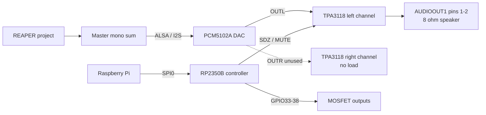
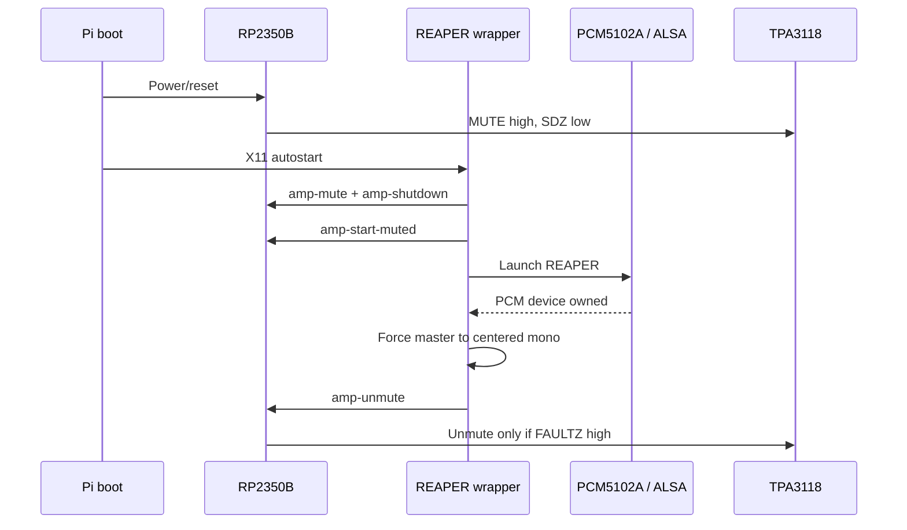
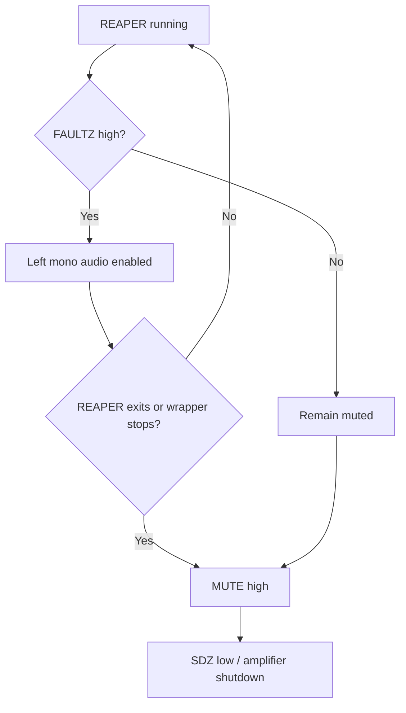

# Dreammachine_Rpi_popo

> **HARDWARE HOLD:** Do not apply external 12 V to any custom shield until
> R78/R79/R81 control nets and C65/C67 single-ended inputs have been reworked
> and signed off using [AMP_TEST.md](AMP_TEST.md). PCM5102A pin 17 `XSMT` must
> also be tied to `+3.3VDAC` per [DAC_TEST.md](DAC_TEST.md). USB-C logic-only
> operation is allowed.

Raspberry Pi control system for **DREAMMACHINE**, for an art installation. Each Pi runs a REAPER session through the custom PCM5102A
sound shield, while a Python service drives a synchronized LED strip, reacting
live to REAPER's transport/playback state over OSC (ReaOSC). The whole thing
boots unattended, kiosk-style — no keyboard, mouse, or monitor required on site.

Reference build: **sjcdm1** (unit 1). Once verified end-to-end, the exact same
setup is cloned to 4 more identical Pis — see [MIGRATION.md](MIGRATION.md).


```mermaid
flowchart LR
  A["REAPER project"] --> B["Master mono sum"]
  B -->|"ALSA / I2S"| C["PCM5102A DAC"]
  C -->|"OUTL"| D["TPA3118 left channel"]
  D --> E["AUDIOOUT1 pins 1-2\n8 ohm speaker"]
  C -.->|"OUTR unused"| F["TPA3118 right channel\nno load"]
  G["Raspberry Pi"] -->|"SPI0"| H["RP2350B controller"]
  H -->|"SDZ / MUTE"| D
  H -->|"GPIO33-38"| I["MOSFET outputs"]
```

The installation is **mono, left output only**. REAPER sums its master to
centered mono at runtime. Never parallel or bridge the TPA3118 left and right
outputs; leave AUDIOOUT1 pins 3-4 disconnected.


```mermaid
sequenceDiagram
  participant Boot as Pi boot
  participant RP as RP2350B
  participant R as REAPER wrapper
  participant DAC as PCM5102A / ALSA
  participant AMP as TPA3118

  Boot->>RP: Power/reset
  RP->>AMP: MUTE high, SDZ low
  Boot->>R: X11 autostart
  R->>RP: amp-mute + amp-shutdown
  R->>RP: amp-start-muted
  R->>DAC: Launch REAPER
  DAC-->>R: PCM device owned
  R->>R: Force master to centered mono
  R->>RP: amp-unmute
  RP->>AMP: Unmute only if FAULTZ high
```


```mermaid
flowchart TD
  A["REAPER running"] --> B{"FAULTZ high?"}
  B -->|"Yes"| C["Left mono audio enabled"]
  B -->|"No"| D["Remain muted"]
  C --> E{"REAPER exits or wrapper stops?"}
  E -->|"No"| A
  E -->|"Yes"| F["MUTE high"]
  D --> F
  F --> G["SDZ low / amplifier shutdown"]
```

## Status

| Unit | Hostname | Tailscale | RustDesk ID | Audio | REAPER + OSC | LED service | FLS protocol | Autoboot |
|---|---|---|---|---|---|---|---|---|
| 1 | sjcdm1 | 100.64.131.41 | 336347711 | ✅ | ✅ | ✅ | ✅ | ✅ |
| 2 | sjcdm2 | 100.114.177.74 | 336348152 | ✅ | ✅ | ✅ | ✅ | ✅ |
| 3 | sjcdm3 | 100.85.254.127 | 336348338 | ✅ | ✅ | ✅ | ✅ | ✅ |
| 4 (reference) | sjcdm4 | 100.103.58.47 | 336348023 | ✅ | ✅ | ✅ | ✅ | ✅ |
| 5 | sjcdm5 | 100.93.96.91 | 336347026 | ✅ | ✅ | ✅ | ✅ | ✅ |

All units provisioned with `provisioning/provision_unit.sh` v2. See [MIGRATION.md](MIGRATION.md) for cloning details.

## Hardware / OS

| Item | Value |
|---|---|
| Board | Raspberry Pi 4 Model B Rev 1.5 |
| OS | Raspberry Pi OS (Debian 13 "trixie"), 64-bit, desktop (X11/Openbox — see Troubleshooting) |
| Sound shield | Custom PCM5102A (`hifiberry-dac` overlay, ALSA `snd_rpi_hifiberry_dac`) |
| LED control | RP2350B GPIO33-38; SPI-driven from Pi |
| Remote access | Tailscale (mesh VPN) + RustDesk (headless-capable) |
| Notifications | Telegram bot + email on boot/join |
| Remote commands | `/status` `/update` `/flash` `/fls` `/flsstop` via Telegram |

**GPIO 18, 19, and 21 are reserved for PCM5102A I2S. GPIO16-20 are reserved
for RP2350B SPI/IRQ, GPIO23/24 for SWD debug, and GPIO0/1 for serial.** The
`dreammachine-led.service` runs `led/led_controller_spi.py` (OSC-driven,
SPI-based) — the legacy direct-GPIO `led_controller.py` is deprecated.

## Network

| Pi | Hostname | User | Tailscale IP | RustDesk ID | RustDesk PW |
|---|---|---|---|---|---|
| 1 | sjcdm1 | sjc | 100.64.131.41 | 336347711 | OMRdream1 |
| 2 | sjcdm2 | sjc | 100.114.177.74 | 336348152 | OMRdream2 |
| 3 | sjcdm3 | sjc | 100.85.254.127 | 336348338 | OMRdream3 |
| 4 | sjcdm4 | sjc | 100.103.58.47 | 336348023 | OMRdream4 |
| 5 | sjcdm5 | sjc | 100.93.96.91 | 336347026 | OMRdream5 |

Password for `sjc` user: `sjcsjc` (only needed until the SSH key is installed).
WiFi: OMR-Equipo (equipment network — OMR-VISITAS has AP isolation).

SSH pattern (Windows PowerShell):
```powershell
$env:PATH += ";C:\Windows\System32\OpenSSH"
ssh -i "$env:USERPROFILE\.ssh\id_ed25519_dreammachine" -o IdentitiesOnly=yes -o StrictHostKeyChecking=no sjc@<TAILSCALE_IP>
```

**Headless RustDesk fix:** all units have `video=HDMI-A-1:1920x1080@60e` in
`/boot/firmware/cmdline.txt` and `/etc/xdg/autostart/set-display-resolution.desktop`
to force 1080p output even with no monitor attached. Without this, RustDesk shows
"No Displays".

## Repo layout

```
setup/            install scripts, run once per Pi (idempotent)
config/           dreammachine.env — single source of config (pins, ports, paths)
led/              led_controller_spi.py — OSC-driven LED controller (SPI to RP2350)
reaper/           Lua autoloop scripts, startup, force_master_mono, ensure_reaper_audio
systemd/          unit files installed on the Pi (start_reaper.sh with amp watchdog)
tools/            utilities (speaker_test: speaker comparison/calibration signals)
provisioning/     cloud-init, provision_unit.sh v2, notify.py, telegram_bot.py,
                  dm_update.sh, fls_trigger.py, spi_test.py, amp_test.py
rp2350/           RP2350B firmware (main.c, CMakeLists, pattern.py test scripts)
Dreammachine_LIGHTCODE/  FLS research protocol reference (fls_60min_rp2350b.ino)
golden-master/    sjcdm4 state snapshot (reaper.ini, RPP, scripts, services)
MIGRATION.md      steps to clone the working setup to Pi 2-5
```

## Setup order (on a fresh Pi)

```bash
bash setup/01_system_base.sh      # apt update/upgrade, gpiozero/lgpio, python venv, alsa
bash setup/01_audio_dac.sh        # enable PCM5102A overlay; reboot and run again to test
bash setup/02_install_reaper.sh   # download + install REAPER (aarch64 eval)
bash setup/04_vnc_and_autostart.sh  # enable VNC, kiosk autologin, REAPER autostart
bash setup/05_install_reaper_extensions.sh  # SWS/S&M + ReaPack (restart REAPER after)
```
Or run all at once: `bash setup/run_all.sh`

Do not run `setup/03_led_service.sh` on the custom shield. It belongs to the
older direct-GPIO design and will be replaced by the RP2350B SPI service.

**One-shot provisioning** (recommended): use `provisioning/provision_unit.sh v2`
on a fresh Pi. Requires /tmp assets: reaper.tar.xz, reaper_sws-aarch64.so,
reaper_reapack-aarch64.so, rustdesk-aarch64.deb, dreammachine_rp2350.elf.
Handles: packagekitd kill, REAPER nested path detection, rpd-x session force,
RustDesk per-unit password, RPP reference fix, all autostart files.

After `02_install_reaper.sh`, REAPER must be **launched once via VNC/HDMI** to
create `reaper.ini`, then the audio device and OSC control surface are
configured manually (see [reaper/OSC_SETUP.md](reaper/OSC_SETUP.md)) — this
only needs doing once, then `reaper.ini` is copied verbatim to the other Pis.

Before connecting speakers or enabling the amplifier, complete the repeatable
[PCM5102A DAC acceptance test](DAC_TEST.md) on each unit.

Before applying 12 V, complete the mandatory control-net rework and staged
[TPA3118D2 amplifier test](AMP_TEST.md).

RP2350B firmware flashing, the SPI pin map, command protocol, and pattern test
are documented in [RP2350.md](RP2350.md).

### RP2350 command set (single-byte SPI)

| Byte | Action |
| ---: | --- |
| `0x00` | All MOSFETs off + amp shutdown + stop fades |
| `0x01`-`0x06` | Pulse channel 1-6 for 500 ms (blocking) |
| `0x07` | Dual pulse AMOS1+2, 100 ms (kick-sync, blocking) |
| `0x08` | **AMOS1+2 held ON** (non-blocking, until 0x09/0x00) — FLS strobe |
| `0x09` | **AMOS1+2 OFF** (non-blocking) — FLS strobe |
| `0x10` | Chase pattern |
| `0x11` | Bounce pattern |
| `0x12` | Flash all 5x |
| `0x20`-`0x23` | Amp control (shutdown / start-muted / unmute / mute) |
| `0x51`-`0x56` | Fade IN channel 1-6 (0→100% over ~1 s, non-blocking) |
| `0x61`-`0x66` | Fade OUT channel 1-6 (100→0% over ~1 s, non-blocking) |
| `0x71`-`0x76` | Stop fade on channel 1-6 and turn off |

**FLS protocol note:** `0x08`/`0x09` were added because `0x07` blocks the RP2350
main loop for 100 ms, making Pi-side variable duty-cycle strobing impossible.
The Pi now sends `0x08` (ON) + `0x09` (OFF) with microsecond-precision sleeps
for the full 16-phase, 60-minute research protocol (0.2-18 Hz, 0-50% duty).

## REAPER extensions (SWS/S&M + ReaPack)

`setup/05_install_reaper_extensions.sh` installs two community-standard REAPER
extensions straight into `~/.config/REAPER/UserPlugins/`:

- **[SWS/S&M](https://www.sws-extension.org/)** (`reaper_sws-aarch64.so`) — a large
  bundle of extra actions, tools and utilities (batch processing, extra track/item
  management, grooves, notes, etc.) that most non-trivial REAPER setups rely on.
- **[ReaPack](https://reapack.com/)** (`reaper_reapack-aarch64.so`) — REAPER's
  package manager. It lets REAPER pull in and auto-update community scripts,
  JSFX effects, and themes from public repositories, instead of copying files by
  hand.

Both are official aarch64 Linux builds (SWS's bleeding-edge build page publishes
the only aarch64 binary available; ReaPack's GitHub release provides one
directly). ⚠️ The ReaPack `.so` **must** keep its `-aarch64` filename suffix —
renaming it triggers a "not loaded from the standard extension path" warning,
since ReaPack uses that suffix to find the right asset for its own self-updates.

Once installed (REAPER needs a restart to load new extensions), use
**Extensions > ReaPack > Synchronize packages** to pull in the package
index, then **Extensions > ReaPack > Browse packages** to search and install
any additional scripts/JSFX from the community repositories — this is how
REAPER's functionality gets extended going forward without editing this repo.

## Tremor sound source (real seismic sonification)

`reaper/tremor_samples/` contains real ground-motion audio generated with
[DZA01](https://github.com/RVX/DZA_Borehole_Sonification), a GPL-3.0 sonification
toolkit that pulls live seismic data from the DZA borehole network (KIT/GPI,
Germany) and speeds it up into the audible range (a straight frequency shift,
no synthesis). One clip per site/depth combination, 3 minutes each, 0.5–10 Hz
bandpass, 100x speed-up, vertical channel:

| File | Site | Sensor |
|---|---|---|
| `tremor_DZA11_surface_vertical.wav` | Site 1 | surface (Trillium Compact 20s) |
| `tremor_DZA13_borehole_vertical.wav` | Site 1 | borehole, ~240 m depth |
| `tremor_DZA31_surface_vertical.wav` | Site 3 | surface (Trillium Horizon 120s) |
| `tremor_DZA33_borehole_vertical.wav` | Site 3 | borehole, ~240 m depth |

Import these into the REAPER project as audio items to use as ambient/tremor
material (the borehole clips are quieter/deeper-feeling; the surface clips
carry more transient detail). Regenerate or fetch a fresh/longer window any
time with the toolkit itself, e.g.:
```bash
python DZA01.py --sites 1,3 --listen-minutes 3 --channel all fetch plot sonify
```

## Speaker test/calibration signals

`tools/speaker_test/generate_speaker_test_signals.py` synthesizes a full set
of 24-bit/48kHz WAV test signals (reference tone, pink/white noise, log
sweeps, ISO 1/3-octave band scan, impulse/square wave, polarity pulse, stereo
L/R identification, a synthesized kick transient, and multi-level THD probe
tones) for comparing candidate speakers and picking one for the installation.
See [tools/speaker_test/README.md](tools/speaker_test/README.md) for the full
test protocol and `tools/speaker_test/scorecard_template.csv` to log results.
Generate with:
```bash
cd tools/speaker_test
python -m venv venv && venv/Scripts/activate  # or source venv/bin/activate
pip install -r requirements.txt
python generate_speaker_test_signals.py
```

## Sound shield HAT ID EEPROM

The RaspiAudio Audio+ V3 shield carries a small I2C ID EEPROM (address `0x50`)
that tells the Pi which device-tree overlay to load — this is what lets the
board auto-detect as `snd_rpi_hifiberry_dac` with no `config.txt` edits.
Decoded contents (read on sjcdm1, `raspi-utils-eeprom` package):

```
# Start of atom #0 of type 0x0001 and length 49
# Vendor info
product_uuid 23d8a259-e02b-40b6-97d1-052bd892f32f
product_id 0x2424
product_ver 0x0001
vendor "Raspiaudio.com"   # length=14
product "Pi Audio V3"   # length=11
# End of atom. CRC16=0xc525

# Start of atom #1 of type 0x0002 and length 32
# GPIO map info
gpio_drive 0
gpio_slew 0
gpio_hysteresis 0
back_power 0
#        GPIO  FUNCTION  PULL
#        ----  --------  ----
setgpio  2      ALT0     DEFAULT
setgpio  3      ALT0     DEFAULT
setgpio  18      ALT0     DEFAULT
setgpio  19      ALT0     DEFAULT
setgpio  20      ALT0     DEFAULT
setgpio  21      ALT0     DEFAULT
# End of atom. CRC16=0x4280

# Start of atom #2 of type 0x0003 and length 16
dt_blob "
hifiberry-dac
\"
# End of atom. CRC16=0x8c03
```

Confirms the shield is a RaspiAudio "Pi Audio V3" board identifying itself via
the `hifiberry-dac` overlay.

**How this was produced** (note: `rpi-eeprom-config`/`rpi-eeprom-update` are a
different tool for the Pi's own bootloader SPI EEPROM — not this):

1. The dedicated ID EEPROM I2C bus is off by default; enable it with
   `dtparam=i2c_vc=on` appended to `/boot/firmware/config.txt`, then reboot.
   A new bus appears (`i2c-0` here); confirm the EEPROM address with
   `sudo i2cdetect -y 0` (`0x50` = standard HAT/HAT+).
2. Dump the raw binary with `eepflash.sh` (from `raspi-utils-eeprom`):
   ```bash
   sudo eepflash.sh -r -y -f=hifiberry_eeprom_dump.eep -t=24c32 -d=0 -a=50
   ```
3. Decode the binary into the human-readable atoms shown above:
   ```bash
   eepdump hifiberry_eeprom_dump.eep hifiberry_eeprom_dump.txt
   ```

## Troubleshooting

**"Error opening devices... JACK error creating client"** on first boot: REAPER
auto-picks JACK as its audio system because `libjack-jackd2-0` is present
(pulled in as a dependency), even though no JACK server runs on the Pi. Fix
once via Preferences > Audio > Device > Audio System: `ALSA`, Device:
`hw:3,0` (see [reaper/OSC_SETUP.md](reaper/OSC_SETUP.md)).

**"There was an error opening the project: Dreammachine_popo_01.RPP"** on
first boot: expected until the project is saved for the first time via
**File > Save As** (see [reaper/OSC_SETUP.md](reaper/OSC_SETUP.md)) — the
autostart script always points at this path.

**Drag-and-drop into REAPER doesn't work (Insert > Media File does)**: the
default Raspberry Pi OS desktop session is `labwc` (Wayland); REAPER is an
X11-only app and runs under it via XWayland. Drag-and-drop across the
XWayland↔native-Wayland boundary (e.g. from the file manager) is unreliable on
wlroots-based compositors like labwc — this happens with a directly-connected
mouse/keyboard too, it isn't VNC-specific. `setup/04_vnc_and_autostart.sh`
switches the session to plain X11 (`raspi-config nonint do_wayland W1`,
Openbox) instead, which avoids the problem entirely; REAPER's autostart is
then configured via `~/.config/lxsession/rpd-x/autostart` +
`systemd/start_reaper.sh` rather than a labwc autostart file.

**RustDesk shows "No Displays" / black screen headless**: no monitor attached =
X11 has no active outputs. Fix: `video=HDMI-A-1:1920x1080@60e` in
`/boot/firmware/cmdline.txt` + `/etc/xdg/autostart/set-display-resolution.desktop`
to force 1080p. Applied to all units.

**REAPER playing but no sound from speakers (recurring after reboot)**: root
cause found 2026-09-29 — `amp_unmute()` in `rp2350/main.c` did a single
one-shot check of `FAULTZ`/`SDZ` at the exact moment the `0x22` unmute command
arrived. `amp_start_muted()` only waited 20 ms after raising `SDZ` before the
Pi sent unmute, and the TPA3118 sometimes hadn't released `FAULTZ` yet in that
window — the amp then latched muted permanently with no retry. Fixed by (a)
increasing the post-`SDZ` settle time to 60 ms and (b) making `amp_unmute()`
retry-poll `FAULTZ`/`SDZ` for up to 300 ms before giving up. Flashed to dm4,
confirmed fixed. Needs reflashing on dm1/2/3/5 (see Changelog below). Manual
override if it ever recurs: `python3 provisioning/amp_test.py` (sends 0x21
start + 0x22 unmute). The `start_reaper.sh` amp watchdog (every 30 s) also
auto re-sends unmute if the DAC PCM device closes unexpectedly.

**FLS strobe not triggering**: verify `0x08`/`0x09` firmware commands are
flashed (post-2026-09-27). Use `python3 provisioning/spi_test.py strobe` to
test raw hardware. The Telegram `/fls` command uses `fls_trigger.py` (not
inline `python3 -c`) to avoid shell quoting bugs.

**OpenOCD "Unable to reset target" / "transport not selected"**: the flash
command needs `-f target/rp2350.cfg` after the interface cfg. Fixed in
`telegram_bot.py` and `dm_update.sh`.

**SSH host keys missing after cloud-init**: run `sudo ssh-keygen -A && sudo
systemctl restart ssh` on first boot. Recurring on all new units.

**AP isolation on OMR-VISITAS**: use OMR-Equipo network instead. Guest network
blocks Pi-to-Pi and Pi-to-Tailscale traffic.

**dpkg lock by packagekitd**: killed automatically in `provision_unit.sh` v2
before dpkg operations.

## Robustness measures

- `dreammachine-led.service` runs as a systemd service with `Restart=always`.
- LED script installs a `SIGTERM` handler so `systemctl stop` / reboot always
  turns the strip off cleanly instead of leaving the last PWM duty cycle
  latched on the MOSFETs.
- Pi boots straight to desktop (autologin, kiosk), REAPER autostarts and loads
  the project automatically — no keyboard/monitor needed on site.
- Hardware watchdog enabled (see `setup/04_vnc_and_autostart.sh`).
- **Amp watchdog**: `start_reaper.sh` spawns a background subshell that every
  30 s verifies the DAC PCM device is still open; if closed unexpectedly, it
  re-sends `amp-unmute`. Prevents silent audio after REAPER glitches.
- **Screen blanking disabled**: `10-noblank.conf` for X11 + `consoleblank=0` in
  cmdline.txt.
- **SD corruption protection**: logrotate configured, `noatime` on ext4,
  overlayfs documented in `provisioning/OVERLAY_PROTECTION.md` (pre-shipping).
- **Boot notifications**: `provisioning/notify.py` sends Telegram + email with
  hostname, Tailscale IP, WiFi status, service states, CPU temp, disk usage,
  RustDesk ID. Waits for real internet (ping 8.8.8.8 + DNS resolve) up to 3 min.
- **Remote update**: `/update` or `/updatedm<N>` on Telegram triggers
  `dm_update.sh` — git pull, redeploy changed files, restart services, flash
  RP2350 if .elf changed (gated on `FIRMWARE_AUTOUPDATE=1`).

## License

Internal production tooling for the DREAMMACHINE installation. No license
granted for reuse outside the project unless stated otherwise by the author.

## Credits

Built for **DREAMMACHINE** by Víctor Mazón Gardoqui. 2026.

---

## Changelog — 2026-09-27/28 session

### Added
- FLS 60-minute stroboscopic protocol (16 phases, 0.2-18 Hz, 0-50% duty,
  sinusoidal modulation, AMOS1+2 synced) via OSC `/fls/start` `/fls/stop`
  and Telegram `/fls` `/flsstop`
- RP2350 firmware commands `0x08`/`0x09` (non-blocking dual ON/OFF) for
  precise Pi-side strobe timing
- `provisioning/fls_trigger.py` — helper script for bot OSC triggers
- `provisioning/spi_test.py` — raw SPI hardware test (pulse/strobe/on/off)
- `provisioning/amp_test.py` — manual amp start/unmute for diagnostics
- `provisioning/set-display-resolution.desktop` — force 1080p headless
- Amp watchdog in `start_reaper.sh` (30 s interval, auto re-unmute)

### Fixed
- Telegram bot `/fls` shell quoting bug (inner double quotes truncated
  `python3 -c` command; replaced with script file)
- `_precise_sleep` ValueError on negative remaining time (race condition)
- OpenOCD missing `-f target/rp2350.cfg` in `/flash` and `dm_update.sh`
- Headless RustDesk "No Displays" (forced HDMI + autostart resolution)
- `start_reaper.sh` executable bit lost on Windows git checkouts

### Deployed to fleet
- All 5 units: forced HDMI fix, updated `start_reaper.sh` watchdog
- dm4 + dm5: full FLS firmware + bot + controller updates
- dm1/2/3: pending next online (Tailscale unreachable at time of writing)

---

## Changelog — 2026-09-29 session

### Fixed
- **Root-caused the recurring "no audio after reboot" bug**: `amp_unmute()`
  in `rp2350/main.c` was a one-shot `FAULTZ`/`SDZ` check with no retry. If
  `FAULTZ` was still transiently low when `0x22` arrived (TPA3118 hadn't
  finished waking from shutdown — only 20 ms settle time was given), the amp
  latched muted permanently until manually recovered. Confirmed NOT caused by
  routing, 12 V rail, or speaker impedance (all verified good with multimeter
  and REAPER UI meters) before tracing it to this firmware race.
  - `amp_start_muted()`: settle time after raising `SDZ` increased 20 ms → 60 ms
  - `amp_unmute()`: now retry-polls `FAULTZ`/`SDZ` every 10 ms for up to 300 ms
    before giving up (was: single check, silent permanent mute on failure)
- Rebuilt and reflashed RP2350 firmware on dm4, verified via full
  `start_reaper.sh` restart cycle — amp unmuted cleanly, audio confirmed audible.

### Deployed to fleet
- dm4: firmware rebuilt + reflashed, verified working
- dm1: `git pull` (was 25 commits behind) + firmware reflashed, verified working
- dm2: firmware reflashed via prebuilt `.elf` (git pull skipped — unit has
  local uncommitted `led_controller_spi.py` customizations left untouched),
  verified working
- dm3/dm5: unreachable at time of writing (offline / Tailscale down) —
  pending reflash next time online
